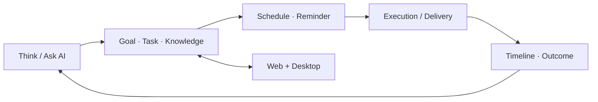

# 知行 MemoFlow

> **AI-first personal productivity workspace** — 让对话、目标、任务、知识、日程、提醒与执行结果处在同一个持续工作流里。

<p align="left">
  <a href="https://memoflow.bakersean.top"><strong>Live Web App</strong></a> ·
  <a href="https://bakersean168.github.io/memoflow/"><strong>Project Page</strong></a> ·
  <a href="./docs/product/README.md"><strong>Product Docs</strong></a> ·
  <a href="./docs/architecture/README.md"><strong>Architecture</strong></a>
</p>

MemoFlow 是一个面向个人长期使用的 AI 效能工作区。它不是把 Chatbot 放到传统 Todo App 旁边，而是让 AI 对话与 Goal、Task、Note、Schedule、Reminder、Notification 等业务对象共享同一套产品上下文：用户可以在对话中形成意图，再进入结构化工作区确认、编辑、执行和追踪结果。

当前仓库同时包含 Web、Electron Desktop、API、共享领域包、契约、AI runtime、同步与发布基础设施，是一个完整的多端产品工程，而不只是前端 Demo。

## Product model



### What you can do

- **AI workspace** — 持续对话、open chat，以及面向 Goal / Task / Knowledge 的 typed AI workflow。
- **Goals & tasks** — 把方向拆成可执行目标和任务，并保留业务状态、关系与结果。
- **Notes / repository** — 管理知识与资源，并把内容作为工作流中的可引用上下文。
- **Schedule & reminders** — 把任务和计划连接到时间语义，而不是维护另一套孤立日历数据。
- **Notifications & delivery** — 通过统一 operation / delivery contract 追踪通知意图、尝试与结果。
- **Web + Desktop** — Vue Web 与 Electron Desktop 共享核心业务契约；PowerSync 支撑跨端数据同步路径。

## Workspace experience

桌面工作区采用三栏模型：

```text
Conversation sidebar | AI collaboration | Business workspace
                     |                  | Goal / Task / Note /
                     |                  | Schedule / Reminder ...
```

AI 区是持续协作入口，右侧业务区则拥有结构化状态和更大的编辑面积。顶部全局入口可以直接打开 Goal、Task、Note、Reminder、Schedule、Notification；业务 Tab 表达当前上下文，而不是再复制一套导航。

See [`docs/product/workspace-ui.md`](./docs/product/workspace-ui.md) for the current workspace contract.

## Engineering highlights

| Concern | MemoFlow approach |
| --- | --- |
| Cross-surface consistency | centralized `@memoflow/contracts` + transport parity |
| AI runtime | TypeScript + Mastra, hosted inside the product runtime |
| Durable AI workflows | typed workflow state, recovery/cancel paths, product-owned projections |
| Modular business domains | Goal / Task / Schedule / Reminder / Notification / Repository packages |
| Multi-client data | PostgreSQL + PowerSync + explicit offline/query-cache policy |
| Delivery semantics | operation, occurrence, delivery intent/attempt/receipt contracts |
| Auditability | unified operation timeline, replay and execution context |
| Quality gates | Nx-governed lint/typecheck/test, browser flows, coverage/performance/delivery oracles |

## Architecture

```text
┌──────────────────────────────────────────────┐
│ Web (Vue)          Desktop (Electron + Vue) │
└───────────────┬───────────────┬──────────────┘
                │ shared contracts / client APIs
                ▼
┌──────────────────────────────────────────────┐
│ API / composition root                      │
│ Express · Zod · Prisma · Mastra runtime     │
└───────────────┬───────────────┬──────────────┘
                │               │
                ▼               ▼
          PostgreSQL          Redis
                │
                ▼
            PowerSync
```

The monorepo keeps product surfaces thin and pushes reusable business behavior into shared packages:

```text
apps/
├── api/        Express API + server composition
├── desktop/    Electron desktop client
├── web/        Vue web client
└── mobile/     Mobile container / future surface

packages/
├── contracts/  Public cross-layer contracts
├── ai/         Mastra-based AI runtime and workflows
├── goal/ task/ schedule/ reminder/ notification/ ...
├── app-vue/    Shared Vue application layer
├── ui-*/       UI primitives / adapters
└── utils/      Shared support code

docs/           Product, architecture, ADR, standards, deployment and plans
tools/          CI, governance, runtime and test-system tooling
```

## Tech stack

- **Language:** TypeScript 6
- **Workspace:** Nx 23, pnpm 11
- **Web:** Vue 3, Vite 8, Tailwind CSS 4, shadcn-vue
- **Desktop:** Electron 43 + Vue 3
- **API:** Express 5, Zod, Prisma
- **AI:** Mastra 1.x
- **Data:** PostgreSQL, Redis, PowerSync
- **Testing:** Vitest, Playwright, Storybook, axe-core
- **Delivery:** GitHub Actions, Docker Compose, Alibaba Cloud ACR + ECS

## Quick start

### Prerequisites

- Node.js 22.13+
- pnpm 11+
- Docker with Compose for local infrastructure

### Install and run

```bash
git clone https://github.com/BakerSean168/memoflow.git
cd memoflow
pnpm install
cp .env.example .env.local
pnpm docker:dev:up
pnpm nx run-many -t serve --projects=api,web --parallel=2
```

For Desktop development:

```bash
pnpm nx run desktop:serve-safe
```

`desktop:serve-safe` prepares dependencies and rebuilds Electron native modules. Once the environment is warm, `pnpm nx run desktop:serve` is the faster inner loop.

Full local-development guidance: [`docs/guides/development/local-development.md`](./docs/guides/development/local-development.md).

## Quality & verification

The repository treats product and architecture contracts as executable gates rather than README promises.

```bash
pnpm lint
pnpm typecheck
pnpm test
pnpm e2e
pnpm docs:check
pnpm governance:check
```

CI also runs dedicated governance, integration, browser-flow, coverage, performance and delivery observations before protected `main` can move.

## Production

The current Web production entry is **[memoflow.bakersean.top](https://memoflow.bakersean.top)**.

The GitHub Pages site is intentionally only the public **project showcase**. The actual product continues to use the existing production stack with Web/API/PowerSync/PostgreSQL/Redis behind the repository's deployment contracts.

See [`docs/deployment/README.md`](./docs/deployment/README.md) and [`docs/guides/development/release-workflow.md`](./docs/guides/development/release-workflow.md).

## Documentation map

- [`docs/getting-started/README.md`](./docs/getting-started/README.md) — onboarding.
- [`docs/product/README.md`](./docs/product/README.md) — product capabilities and module map.
- [`docs/product/workspace-ui.md`](./docs/product/workspace-ui.md) — current workspace experience.
- [`docs/architecture/README.md`](./docs/architecture/README.md) — architecture entry point.
- [`docs/architecture/adr/README.md`](./docs/architecture/adr/README.md) — architectural decisions.
- [`docs/standards/README.md`](./docs/standards/README.md) — engineering standards.
- [`docs/test/README.md`](./docs/test/README.md) — testing system.
- [`docs/deployment/README.md`](./docs/deployment/README.md) — production topology and operations.

## Repository status & license

MemoFlow is a **public source repository**, but this repository currently does **not** include an open-source license. Public visibility alone does not grant permission to copy, modify, or redistribute the code; copyright remains with the repository owner unless a license is added later.
