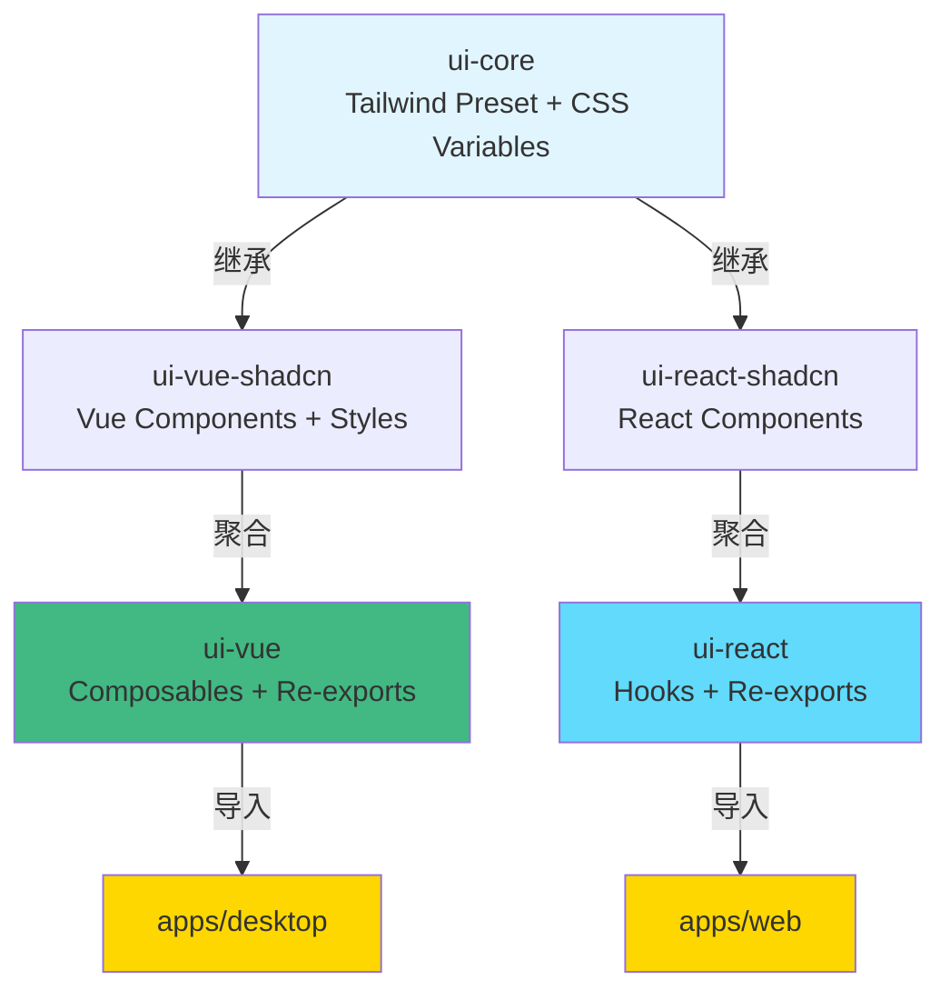

# 联邦 UI 架构配置完成 ✅

## 📋 已完成的配置

### 1. **ui-core** - 设计系统的"宪法"
- ✅ [`tailwind.preset.js`](packages/ui-core/tailwind.preset.js) - Tailwind 配置的单一真理源
- ✅ [`src/styles/globals.css`](packages/ui-core/src/styles/globals.css) - CSS 变量定义（支持 Light/Dark 主题）
- ✅ [`package.json`](packages/ui-core/package.json) - 正确导出 preset 和 styles

### 2. **ui-vue-shadcn** - Vue 组件的"皮肤"层
- ✅ [`tailwind.config.js`](packages/ui-vue-shadcn/tailwind.config.js) - 继承 ui-core preset
- ✅ [`components.json`](packages/ui-vue-shadcn/components.json) - shadcn-vue CLI 配置
- ✅ 组件目录结构：
  - `src/components/ui/` - 官方 shadcn 组件（**不可修改**，[查看说明](packages/ui-vue-shadcn/src/components/ui/README.md)）
  - `src/components/custom/` - 自定义组件（[查看说明](packages/ui-vue-shadcn/src/components/custom/README.md)）
- ✅ [`src/index.ts`](packages/ui-vue-shadcn/src/index.ts) - 组件导出层

### 3. **ui-vue** - Vue 的"总调度中心"
- ✅ [`tailwind.config.js`](packages/ui-vue/tailwind.config.js) - 继承 ui-core preset，扫描依赖组件
- ✅ [`src/index.ts`](packages/ui-vue/src/index.ts) - 聚合导出层（Composables + ui-vue-shadcn 组件）
- ✅ [`package.json`](packages/ui-vue/package.json) - 添加 ui-vue-shadcn 依赖
- ✅ [`README.md`](packages/ui-vue/README.md) - 完整的使用文档

## 🎯 架构关系图



## 🚀 使用指南

### 添加 shadcn-vue 官方组件

```bash
# 在项目根目录执行
cd packages/ui-vue-shadcn
pnpm dlx shadcn-vue@latest add button
pnpm dlx shadcn-vue@latest add card
pnpm dlx shadcn-vue@latest add dialog
```

生成的组件会自动出现在 `packages/ui-vue-shadcn/src/components/ui/` 目录。

### 导出新添加的组件

在 [`packages/ui-vue-shadcn/src/index.ts`](packages/ui-vue-shadcn/src/index.ts) 中：

```typescript
// 取消注释或添加这一行
export * from './components/ui/button';
export * from './components/ui/card';
```

**注意：** 由于 `ui-vue` 已经通过 `export * from '@dailyuse/ui-vue-shadcn'` 自动导出，所以**无需**在 `ui-vue` 中做任何修改！

### 在业务代码中使用

```vue
<script setup lang="ts">
// ✅ 统一从 @dailyuse/ui-vue 导入
import { Button, Card, useFormValidation } from '@dailyuse/ui-vue';

const { errors, validate } = useFormValidation();
</script>

<template>
  <Card>
    <Button @click="validate">验证</Button>
  </Card>
</template>
```

### 引入全局样式

在应用入口（如 `apps/desktop/src/main.ts`）：

```typescript
import '@dailyuse/ui-core/styles/globals.css';
import { createApp } from 'vue';
import App from './App.vue';

createApp(App).mount('#app');
```

## 📝 日常开发 Checklist

### 情景 1: 修改按钮圆角
**位置：** [`packages/ui-core/tailwind.preset.js`](packages/ui-core/tailwind.preset.js)
```javascript
borderRadius: {
  lg: 'var(--radius)',    // 修改这里
}
```

### 情景 2: 修改颜色选择器的计算逻辑
**位置：** `packages/ui-core/src/color-picker.ts`（纯 TS 算法）

### 情景 3: 在 Vue 中增加自动聚焦功能
**位置：** `packages/ui-vue/src/composables/useXxx.ts`（添加 `onMounted` 逻辑）

### 情景 4: 创建自定义组合组件
**位置：** [`packages/ui-vue-shadcn/src/components/custom/`](packages/ui-vue-shadcn/src/components/custom/)

### 情景 5: 更换底层组件库（shadcn → Element Plus）
**位置：** 仅需修改 `packages/ui-vue/src/index.ts` 的导入路径：
```typescript
// 从这个
export * from '@dailyuse/ui-vue-shadcn';
// 改为这个
export * from '@dailyuse/ui-vue-element';
```
**业务代码：** 无需任何修改！🎉

## 🎨 修改主题

所有颜色定义在 [`packages/ui-core/src/styles/globals.css`](packages/ui-core/src/styles/globals.css)：

```css
:root {
  --primary: 221.2 83.2% 53.3%;  /* 修改主色调 */
  --radius: 0.5rem;              /* 修改全局圆角 */
}
```

修改后，所有应用和组件会自动同步！

## 🧪 测试配置

### 运行 Storybook (推荐在 ui-vue 层)
```bash
pnpm nx run ui-vue:storybook
```

### 构建所有 UI 包
```bash
pnpm nx run-many -t build --projects=ui-core,ui-vue-shadcn,ui-vue
```

## 📚 相关文档

- [ui-core README](packages/ui-core/README.md)
- [ui-vue-shadcn 官方组件说明](packages/ui-vue-shadcn/src/components/ui/README.md)
- [ui-vue-shadcn 自定义组件说明](packages/ui-vue-shadcn/src/components/custom/README.md)
- [ui-vue README](packages/ui-vue/README.md)

## ⚠️ 重要约定

### 🚫 不要做的事情

1. **不要修改** `packages/ui-vue-shadcn/src/components/ui/` 中的官方组件
2. **不要在业务代码中**直接导入 `@dailyuse/ui-vue-shadcn`
3. **不要在 ui-core 中**导入 Vue 或 React 相关的依赖

### ✅ 应该做的事情

1. **所有自定义组件**放在 `packages/ui-vue-shadcn/src/components/custom/`
2. **业务代码**统一从 `@dailyuse/ui-vue` 导入
3. **修改设计 Token**在 `ui-core` 中统一修改

## 🎉 配置完成！

你现在拥有了一个完全符合"逻辑与表现分离"原则的联邦 UI 架构：

- ✅ **单一真理源**: 所有设计 Token 在 `ui-core` 统一管理
- ✅ **框架隔离**: 纯逻辑可被 React/Vue/Svelte 共享
- ✅ **组件聚合**: 业务层只需知道一个包 `@dailyuse/ui-vue`
- ✅ **易于替换**: 更换底层组件库无需修改业务代码

开始添加你的第一个组件吧！🚀

```bash
cd packages/ui-vue-shadcn
pnpm dlx shadcn-vue@latest add button
```
