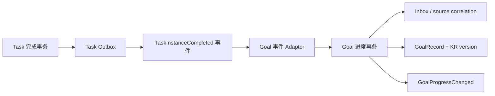

---
tags:
  - plan
  - active
  - architecture
  - goal
  - task
  - reka-ui
  - database
  - concurrency
  - accessibility
  - desktop
description: Reka UI、Goal/KR/Task 一致性、原子写入与桌面工作区的长期重构执行方案
created: 2026-08-01T00:00:00+08:00
updated: 2026-08-01T22:05:00+08:00
---

# Reka UI、Goal 一致性与桌面工作区长期重构计划

> 状态：**Completed / 待归档（W0–W10 全部完成）**
> 优先级：**P0 主产品可靠性线**
> 输入：[2026-07-31 本地部署与产品审查](../../audit/2026-07-31-local-docker-product-review.md)、产品复审截图、ADR-002/003/015/018/023/026/033/035、UI Redesign V2 及其壳层诊断归档。
> 实施原则：当前项目不承担向后兼容和既有业务数据迁移；允许直接重置开发数据库。禁止双写、兼容 shim、旧字段兜底和“先补丁后重构”的过渡实现。

## 1. 目标与完成定义

本计划不是对审查 findings 的逐点打补丁，而是把同类问题收敛到少数高 **Depth** 的 **Module** 中：调用方只依赖稳定、窄小的 **Interface**，状态和并发规则留在 **Implementation** 内，并在正确的 **Seam** 上装配 Web、Electron/PowerSync 与 Prisma **Adapter**。目标是同时提高调用方 **Leverage** 与维护者 **Locality**。

计划完成时必须同时达到以下结果：

1. Vue UI primitive 只使用最新 Reka UI；`radix-vue` 依赖、import、旧包装和旧 CSS 状态选择器全部删除。
2. Goal 是 Goal/KR/Record 写入的唯一一致性中心；一个业务命令只提交一次，并在一个事务中成功或失败。
3. Task 关联只持久化 `goalId`、`keyResultId` 和业务参数，不持久化 Goal/KR 标题或对象快照；数据库使用可查询、可约束的列和外键，不再使用 `goalBinding` JSON。
4. Goal 列表摘要、详情、KR、记录和 Task 绑定选项不再各自保存同一事实的矛盾副本；客户端以 ID 归一化并通过 selector 派生展示。
5. 创建 Goal + 初始 KR、补充 KR、记录进度、Task 完成贡献进度都能立即得到权威结果；不依赖“刷新几组列表碰巧一致”。
6. 并发更新有明确的乐观锁冲突；Task 完成事件至少一次投递时不会重复增加 KR 进度。
7. 表单写入失败不关闭对话框、不丢草稿；业务面板错误不会卸载并清空未提交的 Task/Goal 草稿。
8. AI 供应商默认状态由数据库不变量保证，任一身份最多一个已配置默认供应商。
9. 桌面壳采用单一工作区导航；AI 对话列可收窄，右侧业务面板硬最小宽度大于 AI 列硬最小宽度，并在参考截图尺寸下默认占主导。
10. 所有图标按钮、可点击 Badge、Tab、拖拽把手和自定义控件具备键盘语义、可见焦点和辅助名称。
11. 核心产品旅程、并发/幂等集成测试、Web/Electron 布局矩阵和本地六容器验证全部通过；旧代码删除门禁为零命中。

## 2. 已确认的现状与根因

### 2.1 UI primitive 处于双栈状态

- 2026-08-01 查询 npm registry：`reka-ui` 最新版本为 `2.10.1`；仓库已声明 `^2.10.1`。
- 代码扫描仍有约 196 个文件命中 `radix-vue`，仅约 6 个文件命中 `reka-ui`。
- `packages/ui-vue-shadcn` 同时依赖 `radix-vue@1.9.17` 与 `reka-ui`，Select 等 wrapper 仍从旧库导入。
- P0 的 `Cannot read properties of null (reading 'focus')` 位于旧 Select primitive 的聚焦路径；只在业务调用方判空无法消除其它 primitive 的同类风险。

根因不是单个 Select，而是 primitive **Interface** 没有单一所有者。应用层直接继承两个库的运行时差异、属性名、事件和 `data-*` 状态语义。

### 2.2 Goal 同一事实存在多个可变副本

- Goal store 同时保存 `goals[]`、`currentGoal`、独立 `keyResults[]`，Goal 对象内部又可带 `keyResults`。
- `totalKeyResults`、`completedKeyResults`、`overallProgress` 与 KR 列表并存，详情页通过多级 fallback 读取；陈旧的 `0` 会遮蔽新的 KR 数据。
- GoalRecord 写入后仅刷新 KR/Record，列表摘要与当前 Goal 不一定刷新。
- Task 绑定正式契约已有 `goalId`/`keyResultId`，但前端 view model 又保存 `goalTitle`/`keyResultTitle` 并做 fallback，形成展示快照。
- Task 数据库把整个 `goalBinding` 存成 JSON，无法以外键保证 Goal/KR 关系，也增加了查询和演进成本。

根因是“实体真值”和“查询投影”没有被命名为不同 **Module**。当前 store 把 DTO、缓存、编辑草稿和投影混在一个可变对象图中，任何局部刷新都会制造矛盾版本。

### 2.3 写入工作流由前端串联，失败语义不完整

- GoalDialog 先创建 Goal，再循环创建初始 KR；中途失败会留下半成品 Goal。
- 尚未点击内部“添加关键结果”的有效 KR 只存在于局部输入框，主提交不会纳入命令，因此被静默丢弃。
- GoalRecordDialog 不等待最终写入结果就关闭；失败主要写 console，用户没有可恢复错误。
- 已有 batch KR weight workflow 明确没有 transaction/rollback 语义。
- Task 模块已有 transaction runner 和“提交后发布事件”的良好样板，Goal 模块尚未形成同等级写入 **Seam**。

根因是应用层暴露了过细的“建 Goal”“建 KR”“刷新 A/B/C”操作，调用者被迫理解写入顺序、补偿和缓存一致性，**Interface** 过浅。

### 2.4 跨模块进度贡献缺少 durable 原子链路

- ADR-033 正确要求 Task 完成通过自包含事件通知 Goal，Goal handler 自己更新 Goal 聚合。
- 当前 GoalRecord 已有 `sourceType/sourceId` 唯一相关性基础，但事件发布、事务提交和消费确认之间仍需完整审计。
- 进程内事件一旦在 Task 提交后、Goal 消费前崩溃，可能丢失；重复投递又必须确保不会重复记进度。

这里不能用跨模块分布式事务。长期方案是 Task 本地事务 + transactional outbox，以及 Goal 本地事务 + 幂等 inbox/source correlation。

### 2.5 壳层几何与导航仍偏离参考产品

- 当前常量为 `CHAT_MIN=420`、`PANEL_MIN=360`，与本轮截图所示“窄 AI 列 + 宽右侧工作区”相反。
- 当前业务 Tab 与模块胶囊形成两套并行导航；Tab/关闭热区偏小，层级和间距不统一。
- 参考截图约 1280×900：应用侧栏约 239px、AI/会话列约 350px、右侧工作区约 690px。它证明 AI 列可以明显变窄，业务区应拥有更大的最小可用面。

### 2.6 测试没有覆盖真实 primitive 与失败路径

- 既有组件测试常 stub Select，因而无法复现真实 focus 崩溃。
- GoalDialog 测试覆盖“已加入列表”的 KR，没有覆盖“输入有效但未点内部添加”。
- 现有快乐路径 E2E 没有覆盖“先建 Goal → 后补 KR → 新建 Task 关联该 KR → 记录进度 → 摘要立即更新”。
- 缺少重复事件、并发版本冲突、事务中途失败和草稿保留测试。

## 3. 目标架构

### 3.1 UI Primitive Module：单一 Reka UI Interface

`packages/ui-vue-shadcn` 是应用唯一可消费的 UI primitive **Module**：

- 外部 **Interface** 继续使用项目命名（Select、Dialog、Tabs、Popover、Tooltip 等），不向业务层泄漏 Reka 类型。
- Reka UI 是唯一 **Implementation**；应用源码禁止直接 import `reka-ui`，除非该文件属于 UI primitive 包。
- 每个 wrapper 显式归一 `modelValue`、open 状态、焦点恢复、disabled、portal、事件名与 `data-*` 属性。
- 对关键复合 primitive 建真实挂载 contract tests，不再用空 stub 代替内部交互。
- 迁移结束后删除 `radix-vue`、旧 re-export、旧样式选择器和只为双栈存在的类型转换。

这条 **Seam** 的删除测试：若未来替换 primitive 实现，业务模块无需改 import 和行为测试。

### 3.2 Goal Aggregate Command Module：一次命令、一个事务、一个结果

新增/重塑深 **Module** `GoalAggregateCommand`，公开高层命令而非写入步骤：

```ts
interface GoalAggregateCommandPort {
  createGoal(input: CreateGoalAggregateCommand): Promise<GoalMutationReceipt>;
  addKeyResult(input: AddKeyResultCommand): Promise<GoalMutationReceipt>;
  recordProgress(input: RecordGoalProgressCommand): Promise<GoalMutationReceipt>;
  updateKeyResultWeights(input: UpdateKeyResultWeightsCommand): Promise<GoalMutationReceipt>;
}
```

- `CreateGoalAggregateCommand` 包含 Goal 字段和 `initialKeyResults[]`；服务端在同一事务创建完整聚合。
- `recordProgress` 在同一事务插入 GoalRecord、按 aggregation method 更新 KR current value、递增唯一的 Goal root version，并产出一致投影。
- 批量权重更新在同一事务校验全部输入、更新权重、写审计记录；任一失败全部回滚。
- `GoalMutationReceipt` 至少包含 `goalId`、`goalVersion`、受影响 ID、服务端 materialize 的 `GoalDetailReadModel`；调用方不再自行猜刷新顺序。
- Prisma **Adapter** 和 PowerSync **Adapter** 都实现同一 transaction runner **Interface**；领域和应用代码不探测具体数据库。
- domain event 在事务中缓冲，只有 commit 后发布，沿用 Task transaction runner 的成熟模式。

### 3.3 Goal 数据库模型：关系列是真值，投影是可重建数据

直接执行破坏性 schema 重构：

1. `TaskTemplate.goalBinding` JSON 删除，展开为：
   - `goalId String?`
   - `keyResultId String?`
   - `goalRecordValue Float?`
   - `goalProgressTrigger String?`
2. `goalId`、`keyResultId` 建真实外键和身份范围校验；`keyResultId` 必须属于 `goalId`。
3. Task domain state 中重复的 `goalId`、`keyResultId` 与 `goalBinding` 三份表示收敛为一个 `TaskGoalBinding` 值对象；持久化 mapper 负责列展开。
4. 永久删除 `goalTitle`、`keyResultTitle` 等持久/缓存快照；显示名称通过 Goal read port 按 ID 批量解析。
5. `GoalRecord` 保留业务时间和来源相关性；将来源字段命名收敛为明确的 `sourceEventId`/`sourceEntityId` 结构，并建立与软删除语义相容的唯一索引。
6. 只对聚合根 `Goal.version` 实施 compare-and-swap；KR/Record/Review 不维护会互相矛盾的子版本或软删除状态。
7. 审计所有标为“冗余字段”的列：
   - `KeyResult.currentValue` 作为受事务保护的 canonical accumulator 保留；
   - Goal progress/count 不写入 Goal 行，按 KR 计算或进入明确命名、可重建的 read projection；
   - `GoalStatistic`/folder counts 只有在存在单一 projector、重建命令和一致性测试时保留，否则删除并查询计算。
8. Prisma schema、PowerSync schema、CRUD whitelist、导入导出 projection、fixtures 和生成类型在同一切片更新；开发库直接 reset，不写兼容迁移。

### 3.4 Goal Read Model Module：按 ID 归一化，投影只读

客户端状态改为：

```ts
interface GoalEntityState {
  goalById: Record<string, GoalEntity>;
  keyResultById: Record<string, KeyResultEntity>;
  keyResultIdsByGoalId: Record<string, string[]>;
  recordById: Record<string, GoalRecordEntity>;
  recordIdsByKeyResultId: Record<string, string[]>;
  selectedGoalId: string | null;
}
```

- 禁止保存 `currentGoal` 对象副本；只保存 `selectedGoalId`。
- `GoalListItemReadModel` 与 `GoalDetailReadModel` 是服务器查询投影，不回写领域实体。
- `overallProgress`、KR counts 由一个 selector/投影函数产生；列表、详情、Task binding picker、Dashboard 和 AI query 共用同一算法/契约。
- 每个 mutation receipt 通过单一 `applyGoalMutationReceipt()` 原子合并；没有“先改局部、再并行刷新三组请求”。
- PowerSync 与网络回包均按 Goal root version 合并整个归一化聚合；子实体不独立竞争版本。
- 缺失引用显示明确的“关联已删除/不可用”状态，不回退到陈旧标题快照。

该 **Module** 的删除测试：任何一个 `currentGoal.keyResults`、`goal.keyResults ?? keyResults` 或 `goalTitle ?? snapshotTitle` fallback 都表明重构未完成。

### 3.5 跨模块可靠事件：Outbox + 幂等 Goal Handler

遵循 ADR-033，不引入 Task 调用 Goal repository 的反向依赖：



- Task 完成状态与 outbox row 同事务提交。
- dispatcher 至少一次投递；失败可重试，不在进程内静默丢弃。
- 事件只携带完成 Goal 写入所需的自包含数据：eventId、identityId、task/template/instance ID、goalId、keyResultId、贡献值、trigger、occurredAt。
- Goal handler 在一个事务中登记 eventId、校验关联、创建记录并更新 KR；重复 eventId 返回已有 receipt，不重复贡献。
- commit 后再发 `GoalProgressChanged`，供 read projection、通知等订阅者消费。
- Web API 与 Electron host 都从组合根装配同一 handler；禁止只在某一宿主生效。
- 增加 outbox retention/重放命令与可观测指标：pending、retry、dead-letter、oldest age。

### 3.6 Draft 与错误恢复 Module

- Goal editor 使用一个 `GoalDraft`，其中 KR 草稿是数组项；最后一行只要有效，主提交自动 materialize，不要求用户理解“内部添加”这种第二次提交。
- 若保留“添加另一条 KR”按钮，其语义只是新增输入行，不决定数据是否保存。
- Task/Goal draft store 的生命周期高于 routed panel content；Error Boundary 重建视图后按 draft ID 恢复。
- 写入中禁用重复提交；只有成功 receipt 才关闭对话框和清理 draft。
- 领域/校验/网络/版本冲突转为可见、可操作的错误；版本冲突提供“加载最新内容并比较”，不静默覆盖。
- Error Boundary 保留诊断与重试，但不再承担业务错误展示，也不得清除草稿。

### 3.7 AI 默认供应商不变量

- 未配置的供应商模板只显示“未配置”，绝不显示“默认”。
- `SetDefaultAIProvider` 只接收已配置 provider ID。
- 一个数据库事务完成“清除旧默认 + 设置新默认”；失败全部回滚。
- PostgreSQL 建 identity 范围内 `is_default=true` 的唯一不变量；若 Prisma 无法表达，使用受测试和启动校验保护的幂等 SQL。
- 首个已配置 provider 是否自动成为默认必须是单一明确规则；客户端不从“列表为空”对每个模板各自推导默认。
- 并发设置两个默认时，一个成功，另一个收到可解释冲突并刷新权威状态。

### 3.8 桌面工作区与几何模型

导航收敛为一套：

- 左侧栏只承载账户/项目/AI 会话入口；中间窄列是当前 AI 会话；右侧 BusinessPanel Tab 是业务上下文。
- 头部业务胶囊不再作为第二套常驻导航。可保留一个统一“打开业务工作区”launcher/command palette，但打开后只由 BusinessPanel Tab 表达当前业务上下文。
- Tab 点击目标不小于 36×36 CSS px；关闭按钮可见热区不小于 32×32；相邻关闭热区不重叠。
- Tab bar、panel header、内容 header 只保留一个主标题层级，去掉同义重复。

几何基线采用 design token，而非散落 magic number：

| Token                      |    目标值 | 语义                                                   |
| -------------------------- | --------: | ------------------------------------------------------ |
| `AI_HARD_MIN`              |     320px | AI 消息仍可阅读、Composer 核心动作仍可用的硬下限       |
| `BUSINESS_HARD_MIN`        |     520px | 表格、表单、Goal/Task 工作区的硬下限；必须大于 AI 下限 |
| `BUSINESS_PREFERRED_RATIO` |      0.64 | 分栏可用区中业务面板默认占比                           |
| `BUSINESS_MAX`             |     960px | 宽屏拖动上限；仍受 AI 硬下限约束                       |
| `SIDEBAR_DEFAULT`          | 240–260px | 与当前壳和参考截图一致                                 |

固定验收场景：

- `1280×900`、侧栏约 240px：AI 列目标 340–390px，业务面板目标 650–700px；业务面板必须宽于 AI 列。
- `1440×900`：split 保持业务面板为主，用户可拖大任一侧，但任何合法 split 都满足 `business >= 520`、`ai >= 320`。
- `1200×800`：若侧栏展开后仍满足 320+520，则允许 split；不再因旧 `CHAT_MIN=420` 过早进入 focus。
- `1024×768` 及更窄：无法同时满足两侧硬下限时进入 focus/overlay，不压缩任一列到不可用状态。
- Composer 始终约束在 AI 列内；AI 列接近硬下限时隐藏次级标签、保留发送/停止/附件/模型菜单的可操作入口。
- 用户拖动、窗口 resize、侧栏折叠/展开和持久化恢复都通过同一个 `computeWorkspaceGeometry()`。

具体数值需在实现时用截图与 Electron 实机校准；若调整，必须仍满足 `BUSINESS_HARD_MIN > AI_HARD_MIN` 和上述 1280px 结果区间，并同步 token、测试和设计文档。

### 3.9 无障碍作为 UI Interface 契约

- 禁止 `div/span/Badge` 直接绑定 click；动作使用 Button，导航使用 link，复选/开关使用对应 primitive。
- 仅图标控件必须有本地化 accessible name 和 tooltip；装饰图标 `aria-hidden`。
- Dialog/Popover/Select/Tabs 保持正确焦点进入、循环和关闭后恢复。
- 拖拽把手提供 separator role、方向、当前值以及键盘增减。
- 状态不能只靠颜色；错误消息与字段通过 `aria-describedby` 关联。
- 建立 axe 组件测试与 Playwright keyboard-only journey，并把规则纳入共享 UI review checklist。

## 4. 实施工作包

各工作包都必须以目标结构直接落地；允许一个提交内红/绿重构，不允许主干上长期存在双栈、双写或兼容层。

### W0 — 冻结契约、补失败测试与 ADR

- [x] 新增 ADR：Goal aggregate command、read projection、乐观锁和 outbox/inbox 决策（ADR-038）。
- [x] 修订 ADR-005 与本计划目标架构：Reka-only primitive 标准、单导航、几何 token 和响应式状态机。
- [x] 为审查 P0/P1 建立首批真实回归：Goal 主提交吸收有效末行 KR；Task 关联测试挂载真实 Select 且保留草稿。完整 Goal→KR→Task→Record 旅程随 W3–W6 补齐。
- [x] 增加事务中途失败、重复 eventId、并发 version、重复默认 provider、错误后 draft 保留测试。
- [x] 记录 schema 破坏性变更；开发库使用 `pnpm nx run database:prisma-migrate-reset` 或本地 Docker 数据卷重建，不生成兼容迁移/双写路径。实际 reset 留在 W10 完整容器验证执行。

完成门槛：测试能稳定暴露当前缺陷；ADR 拍板后后续工作不再临场创造第二种模型。

### W1 — 全量迁移到 Reka UI

- [x] 固定 registry 验证的最新 Reka 版本；更新 lockfile，记录 release/migration notes。
- [x] 按 primitive 家族迁移：ConfigProvider/Portal → Dialog/Sheet/Popover/Tooltip → Select/Combobox/Dropdown/ContextMenu → Tabs/Accordion/Collapsible → Form controls/Slider/Calendar/Resizable。
- [x] 更新 import、属性、emit、slot、controlled state 和 `data-*` CSS 选择器。
- [x] 对 Select、Dialog、Dropdown、Tabs、Popover 建真实交互 contract tests，包括动态选项、unmount、焦点恢复和键盘操作；P0 Select 场景使用真实 primitive。
- [x] 应用源码统一从 `@memoflow/ui-vue-shadcn` 消费，不直接依赖 primitive vendor。
- [x] 删除 `radix-vue` dependency、所有 import、旧 wrapper、旧类型适配与死样式。
- [x] 新增 governance：`radix-vue` 零命中；UI primitive 包外 `reka-ui` 零直接 import。

完成门槛：`rg "radix-vue" packages apps` 为零；所有 primitive contract tests、app-vue tests 和真实 P0 回归通过。

### W2 — Goal/Task schema 与领域模型破坏性重构

- [x] 展开 Task Goal binding 为关系列和外键，删除 JSON 列。
- [x] 收敛 Task aggregate 内重复绑定表示；domain、mapper、Prisma/PowerSync Adapter 已同步，外围 portability/read Interface 正在收口。
- [x] 删除 Task 绑定的 title/object snapshot 与 fallback；名称经现有批量 Goal/KR read Interface 按 ID 派生，缺失引用显示 unavailable。
- [x] 明确 Goal/KR/Record/Review ownership：Goal 是唯一并发与软删除根；子实体使用复合租户外键并在根事务内硬协调。
- [x] 删除 GoalStatistic、folder counters 与 aggregate 内注入的摘要覆盖；Goal 摘要统一从完整 KR 集合投影。
- [x] 更新导入导出、PowerSync CRUD、fixtures 和客户端 read model；AI Adapter 保持原有 ID-only contract。
- [x] reset 开发数据库并验证启动时 binding CHECK；Prisma/PowerSync schema 已重新生成且无旧列读取路径。

完成门槛：数据库能直接约束 Task→Goal/KR；无 JSON binding、无标题快照、无三份绑定状态。

### W3 — Goal 原子命令与乐观并发

- [x] 引入 Goal transaction runner **Interface** 及 Prisma/PowerSync **Adapter**。
- [x] 实现 `CreateGoalAggregate`，一次写入 Goal + 所有初始 KR。
- [x] 实现原子 `RecordGoalProgress` 和 `UpdateKeyResultWeights`；整批权重与审计快照一次保存。
- [x] 所有 update/delete 使用 expectedVersion compare-and-swap；统一冲突错误。
- [x] Goal root 与 KR add/update/delete/progress 已统一 expectedVersion CAS；CAS 事务同步完整 Goal 聚合而非只更新根行。
- [x] KR batch weights 与 Goal soft-delete/archive/activate/complete 已贯穿 HTTP/IPC expectedVersion CAS；状态命令强制加载 children，消除根-only 保存误删 KR/Review 风险。
- [x] Goal Review add/update/delete 已贯穿 contract、HTTP/IPC、client service 与 Vue/React expectedVersion CAS；React 删除 `as never` 绕过，客户端从当前 Goal read model 取得版本。
- [x] 自动归档逐 Goal 进入 transaction runner，事务内重载完整聚合并 CAS 保存；冲突回滚且不误计 archivedCount，留待下轮 sweep 重评。
- [x] GoalRecord create/delete 已贯穿 expectedVersion；新增记录与 KR 更新使用同一 transaction runner + Goal CAS，删除记录在同一事务内重算 KR 并保留 Sum 隐式基线。
- [x] 永久删除新增 repository-level version CAS；Prisma 与 PowerSync Adapter 均以 identity + id + version 删除，PowerSync 子实体级联与根删除在同一事务回滚。
- [x] domain events 在事务内缓冲，commit 后发布；发布失败不得伪装为数据库回滚。
- [x] 对外 Goal aggregate command 返回统一 `GoalMutationReceipt`；HTTP/IPC transport 同形；永久物理删除保留独立 tombstone 语义，批量自动归档保留 batch count。
- [x] 前端 GoalDialog、AI 草稿和 API/Desktop AI executor 的 create/loop 已删除，统一提交 `initialKeyResults`；逐项非原子 batch、补偿删除和撤销贡献的非 CAS 写入已清退。

完成门槛：故障注入证明任一步失败数据库零部分写入；并发旧版本写入不会覆盖新数据。

### W4 — Durable Task→Goal 贡献链路

- [x] 定义自包含、版本化的 Task→Goal progress outbox event contract。
- [x] Task transaction runner 同事务幂等写专用 outbox；符合投递条件的完成事件不再双投进程内 event bus。
- [x] API/Desktop 组合根装配 dispatcher、租约轮询 runtime 和 Goal handler。
- [x] Goal 事务以 `(identityId, sourceType, sourceId)` 唯一约束实现业务 inbox/source correlation 幂等、记录写入和 KR 更新。
- [x] 增加 claimed/delivered/retry 结构化 telemetry；持久化 status/attempts/lastError 供诊断。
- [x] retry 已实现封顶指数退避与最大次数 dead-letter；PROCESSING 租约过期可在进程重启后重新领取。
- [x] dead-letter 可按 eventId 原位 replay，重置 attempts/error 后仍沿用同一幂等键。
- [x] 增加“Task commit 后终止进程、重启宿主后自动恢复”的宿主级故障注入 E2E；API 集成测试由子进程提交 Task 后直接退出，再以同一数据库重新装配宿主 runtime，验证 Goal 最终更新且二次重启不重复贡献。
- [x] 删除 Task 完成贡献仅依赖 process-local event delivery 的路径；撤销贡献暂仍使用独立实时事件。

完成门槛：重复投递 2 次只贡献 1 次；在 Task commit 后杀进程，重启后 Goal 最终正确更新。

### W5 — 客户端归一化状态与权威投影

- [x] 用 ID maps 和 relation indexes 重写 Goal store；`selectedGoalId` 取代 `currentGoal` 对象。
- [x] Goal aggregate read-model mapper 是 progress/count 唯一 projector；contract 将三项摘要设为必填，Vue/React 已删除本地重算与缺省 fallback。
- [x] Goal list/detail/KR records/Task picker/Dashboard/AI 统一消费 read model；Task picker 与 React KR/Review/detail 改为单次 aggregate query，Dashboard 直接映射 Goal 权威摘要，AI 直接消费 command receipt 的完整 aggregate read model。
- [x] Goal create/update/delete/status、KR、Review、Record 与 batch weights 均返回统一 `GoalMutationReceipt`；客户端以 `applyGoalMutationReceipt()` 单点合并。
- [x] 删除多级 fallback、分散 refresh 编排和 view-local snapshot 修补；Goal 创建/编辑不再二次刷新列表，React mutation 直接合并 receipt，Focus 视图改为 normalized list selector，并删除旧的独立子列表加载与手工 store mutation action。
- [x] 加 projection invariant tests：同一 receipt 在 normalized list/detail/root selector 显示相同 KR 数量、完成数和进度。

完成门槛：创建/增加 KR/记录进度后所有已打开视图在同一交互周期更新，无手动刷新和“未找到 KR”闪现。

### W6 — 表单单提交、草稿恢复与错误语义

- [x] GoalDialog 使用数组式 KR draft；有效末行自动进入单次 Goal aggregate payload。
- [x] GoalRecordDialog、KeyResultDialog、CreateScheduleDialog 已 await 明确回执后再关闭；GoalFolder 改为自身 await CRUD 回执，Reminder move 改为 await 显式回调，其余 mutation 对话框由受控父级仅在成功后关闭。
- [x] Goal/Task 复杂草稿按 dialog/tab/intent ID 保存到 AppShell 路由子树之上的 draft store；成功或明确取消清除，错误边界重建恢复。
- [x] Panel Error Boundary 仅覆盖 routed business content，错误态改用覆盖层且不卸载原子树；Goal 业务错误统一产生可见 toast，不再只有 console/store side effect。
- [x] 所有写入入口以 saving/submitting/loading 阻止重复提交；失败不关闭、不重置字段和选择，Goal 增加失败保留与重建恢复回归。
- [x] 全量扫描 Dialog/Sheet 的 await、emit close 与 open=false 顺序；修复 GoalFolder 和 Reminder TemplateMove 两条先关闭路径，其余命中为取消、只读选择或成功分支。

完成门槛：网络错误、409 冲突、primitive 异常和面板重建均不静默丢草稿。

### W7 — AI 默认供应商一致性

- [x] 数据库增加“每 identity 最多一个默认 provider”不变量。
- [x] SetDefault 命令事务化并校验 provider 已配置。
- [x] 修正 preset view model；未配置模板不参与默认推导。
- [x] 并发、回滚、首个 provider 和删除默认 provider 的规则测试：首次配置遵循显式选择、不隐式默认；删除默认后保持无默认；并发 set/save 按 identity 串行提交，竞争请求均可成功且最终只有最后提交的一条为默认；事务中途失败保留旧默认。
- [x] 删除 `providerItems.length === 0` 对每个模板都返回 true 的派生路径和两步 save。

完成门槛：任何列表状态最多一个“默认”，且它必定对应可用配置。

### W8 — 单导航、业务主面板与布局系统

- [x] 删除常驻业务胶囊、独立日程胶囊与 BusinessPanel Tabs 的双重导航；实现统一 launcher。
- [x] 重写几何 token 与 `computePanelGeometry()`，采用 `AI_HARD_MIN=320`、`BUSINESS_HARD_MIN=520` 的初始基线。
- [x] 默认 split 按业务 64% 计算，统一处理拖动、窗口 resize、侧栏变化与持久化值 clamp。
- [x] 收敛 Tab/header 层级并将 Tab/关闭/面板操作热区固化为 36/32px 下限；全局 spacing/radius token 仍待审查。
- [x] AI 窄态设计：消息、欢迎页、Goal workflow 与 Composer 改用 `@container/ai`，次级信息按 AI 列宽渐进收缩，不依赖整窗断点。
- [x] 业务面板窄态审查 Goal、Task、Schedule、Reminder、Repository；核心网格改用 `@container/panel`，520px 内操作保持可达；最终实机矩阵仍在下一项验证。
- [x] 更新 1024/1200/1280/1440 Electron 几何和截图矩阵；补充 125%/150% 缩放，窄视口自动收起侧栏且不覆盖用户偏好。

完成门槛：1280px 参考场景落入 340–390px AI、650–700px business；右侧硬最小宽度始终大于 AI 硬最小宽度。

### W9 — 系统性无障碍与交互质量

- [x] 扫描 click handlers、仅图标按钮、无 label 表单、非语义 Tab/Badge 和 drag handles，并建立剩余清单。
- [x] 按共享 primitive 先修 Interface，再修业务调用方：ActionableWrapper 统一具名 32px 菜单触发器，手写确认层迁回 Reka AlertDialog。
- [x] Task recurrence selector、Reminder picker/card、Notification item/capsule 首批控件族已改为具名语义按钮并补 `aria-pressed`/焦点环。
- [x] Schedule Day/Week/Month/DayDetail 事件与日期动作改为互不嵌套的具名按钮，并保持 event/day click 边界。
- [x] 补键盘顺序、焦点环、reduced motion、对比度和 screen reader announcement。
- [x] axe 覆盖关键 dialogs、AI 设置、Goal/Task、BusinessPanel；Playwright 覆盖纯键盘主旅程。
- [x] 将 accessible name/keyboard behavior 加入 UI wrapper contract tests 和治理清单；面板 resize separator、关系筛选与 ActionableWrapper 均有 contract tests。

完成门槛：关键页面 axe 无 serious/critical，纯键盘可完成 Goal→KR→Task→Record 主旅程。

### W10 — 删除、全量验证与文档收口

- [x] 执行删除矩阵并将关键零命中加入 governance：模块内 `div/span/Badge @click` 由 Vue AST audit 固化为零命中。
- [x] 更新 Goal、Task、AI、UI 产品文档和 ADR 状态；删除被新 ADR 取代的矛盾说明。
- [x] 执行相关 Nx lint/typecheck/test/build、Web/Electron E2E、数据库集成测试。
- [x] 完整重建六个 Docker 容器，验证 health、CORS、PowerSync 和核心产品旅程。
- [x] 重新进行产品人工审查，保存截图并清理测试账号/数据。
- [x] 只有所有完成门槛满足后，才把本计划移入 archive。

## 5. 删除矩阵与治理门禁

| 对象/模式                                         | 最终要求              |
| ------------------------------------------------- | --------------------- |
| `radix-vue` dependency/import                     | 0                     |
| UI primitive 包外直接 `reka-ui` import            | 0                     |
| Task `goalBinding` JSON column                    | 0                     |
| `goalTitle`/`keyResultTitle` 绑定快照             | 0（测试文案变量除外） |
| 客户端 `currentGoal` 对象副本                     | 0                     |
| `goal.keyResults ?? keyResults` 一类双源 fallback | 0                     |
| Goal + KR 前端串联创建                            | 0                     |
| 非原子 batch Goal 写入                            | 0                     |
| process-local-only Task→Goal 交付                 | 0                     |
| mutation 成功前关闭 dialog                        | 0                     |
| 写入失败仅 `console.error`                        | 0                     |
| `div/span/Badge @click` 业务动作                  | 0                     |
| 未配置 provider 显示默认                          | 0                     |
| 同义的常驻业务胶囊 + Tab 双导航                   | 0                     |

门禁脚本应检查源码而非生成目录，并允许明确的测试用反例 fixture；任何例外必须在 ADR 中说明，而不是内联 disable。

## 6. 测试策略与验证命令

### 6.1 必测行为

- 创建 Goal 时最后一个有效 KR 未点“新增行”也被原子保存。
- 先建 Goal、后补 KR、Task 关联新 KR：Select 可正常聚焦/选择，Task 草稿不丢。
- 第一次记录进度即成功，Goal list/detail/Dashboard 同步显示新摘要。
- Goal+第 N 个 KR 写入失败时 Goal 与前 N-1 个 KR 都不存在。
- 两客户端用同一 version 更新：一个成功，一个得到 409/typed conflict。
- 同一 Task completion event 重放、并发投递、进程重启均只产生一条 GoalRecord。
- AI provider 并发设默认按 identity 串行完成，最终数据库最多一个默认且没有正常竞争导致的用户可见冲突。
- 业务错误、网络断开、Panel Error Boundary 重试后表单值仍在。
- Reka Select/Dialog/Popover/Tabs 的鼠标、键盘、焦点恢复和动态列表行为。
- 1024/1200/1280/1440 布局矩阵与缩放 125%/150%；业务最小宽度始终大于 AI 最小宽度。

### 6.2 分层命令

每个工作包只跑受影响目标，合并前至少执行：

```powershell
pnpm nx run ui-vue-shadcn:lint
pnpm nx run ui-vue-shadcn:typecheck
pnpm nx run app-vue:lint
pnpm nx run app-vue:typecheck
pnpm nx run app-vue:test
pnpm nx run contracts:test
pnpm nx run goal:lint
pnpm nx run goal:typecheck
pnpm nx run goal:test
pnpm nx run task:lint
pnpm nx run task:typecheck
pnpm nx run task:test
pnpm nx run database:lint
pnpm nx run database:test
pnpm nx run setting:test
pnpm nx run web:e2e
pnpm nx run web:e2e:shell
pnpm nx run desktop:test
pnpm nx run memoflow:governance-check
pnpm prettier --check .
git diff --check
```

若某目标不存在，不以跳过结束：先按 project.json 选择等价目标，必要时为缺失的 UI primitive tests 增加正式 Nx target。

### 6.3 Docker 最终门槛

- 六容器完整 `--build` 重建，不复用旧镜像判断成功。
- Web `127.0.0.1:12137`、API `12136/healthz`、PowerSync `12139/probes/liveness` 正常。
- CORS 预检 204，允许当前 Web origin。
- Prisma schema bootstrap、PowerSync schema、outbox dispatcher 与唯一索引启动校验成功。
- Docker 环境执行 Goal→KR→Task→完成→进度旅程和重复事件验证。

## 7. 提交切片

建议保持每个提交可审查、可回滚，但不保留兼容架构：

1. `test(goal): capture goal-kr-task consistency failures`
2. `docs(adr): define goal command read model and delivery semantics`
3. `refactor(ui): migrate primitives to reka ui`
4. `refactor(task): normalize goal binding schema by ids`
5. `refactor(goal): add atomic aggregate commands and versions`
6. `feat(events): add task outbox and idempotent goal inbox`
7. `refactor(goal-ui): normalize goal read state and receipts`
8. `fix(forms): preserve drafts and await mutations`
9. `fix(setting): enforce one configured default provider`
10. `refactor(shell): make business workspace dominant and unify navigation`
11. `fix(a11y): enforce semantic controls and keyboard journeys`
12. `chore(governance): remove legacy paths and add zero-match gates`

数据库 schema、对应 mapper/contracts/Adapter 和测试必须在同一提交，避免出现代码与数据库不能同时启动的中间提交。

## 8. 风险与控制

| 风险                                      | 控制                                                                                        |
| ----------------------------------------- | ------------------------------------------------------------------------------------------- |
| 全量 Reka 迁移影响面大                    | 按 primitive 家族迁移并跑真实 contract tests；禁止业务层直接 vendor import                  |
| schema 重构同时影响 Web/Desktop/PowerSync | 一个 source-of-truth schema checklist；同提交更新 Prisma、PowerSync、CRUD、fixtures、两宿主 |
| outbox 被过度抽象                         | 先只服务 Task→Goal 这条真实链路；第二个生产消费者出现前不建设通用消息框架                   |
| 归一化 store 造成 UI 大面积改动           | 先固定 read model/receipt Interface，再逐消费方迁移；迁移完成立即删除旧 state，不双写       |
| 乐观锁让冲突变得可见                      | 提供明确 conflict UX 和 reload/compare，不回退 last-write-wins                              |
| 几何 token 在不同缩放下失真               | Electron 实机覆盖 100%/125%/150%，以 CSS px 与可操作性断言为准                              |
| 当前工作区已有大量未提交部署修改          | 只修改本计划明确文件；实施时按切片核对 diff，不覆盖或夹带现有修改                           |

## 9. 明确非目标

- 不为了保留旧数据库数据编写迁移、双读或双写。
- 不保留 `radix-vue` 作为 fallback。
- 不用前端补偿删除模拟事务。
- 不把跨模块写入改成 Task 直接访问 Goal repository。
- 不建设无真实第二用例的通用 event platform/plugin system。
- 不在本计划重写 ADR-035 的 Agent Host；只确保新的 Goal/Task **Interface** 可被 AI Proposal/Executor 正确调用。
- 不以视觉仿制 ChatGPT/Codex 为目标；截图只用于信息层级、几何和交互密度基线。

## 10. 归档条件

只有第 1 节 11 项完成定义、W0–W10 全部门槛、删除矩阵、全量验证和 Docker 产品复审同时满足，才可：

1. 在本文补充最终提交、验证结果和截图路径；
2. 将本文移动到 `docs/plan/archive/`；
3. 更新 active README 和季度归档索引；
4. 宣称“目标 → KR → 任务 → 进度”组合链路达到可发布标准。

## 11. 最终实施与验证记录

2026-08-01 完成 W0–W10。最终实现除了原计划项目，还在人工复审中发现并修复 AppShell KeepAlive 对 Goal ModuleLayout 的双重缓存：缓存 key 现在按 Tab 与首个实际渲染的 matched route record 计算，既避免两份 GoalDialog，也不再让 Task 列表/详情以同 key 复用不同组件。

最终验证摘要：

- app-vue 1002、Goal 428、Task 771、AI 751、Web 70、Desktop 361、contracts 526、database 13、setting 81 项测试通过。
- API 宿主退出/重启贡献恢复集成测试 1/1；Electron 宽度/缩放矩阵通过。
- 最新源码三次完整入镜迭代后，六个长期服务 healthy；Web/API/PowerSync 200，CORS 204。
- Docker 核心产品旅程最终 7/7；Task→Goal Phase A 定点复验 1/1。
- 治理检查、所有本轮变更文件 Prettier、`git diff --check` 通过。
- 清理 22 个 E2E 身份和 1 个人工复审身份；两类测试前缀复查均为 0。

最终复审与截图见 [Goal 一致性与桌面工作区最终复审](../../audit/2026-08-01-goal-consistency-workspace-remediation-review.md)。
