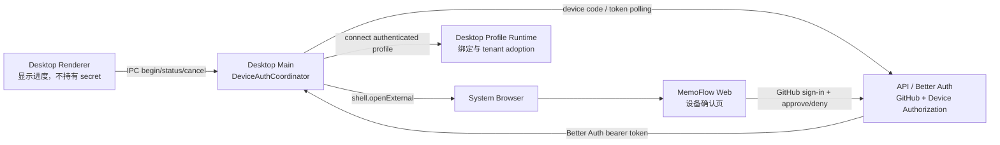
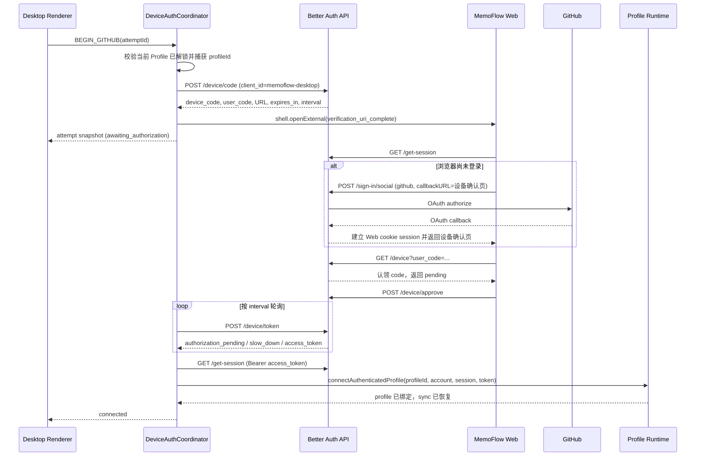

---
tags:
  - plan
  - archive
  - authentication
  - desktop
  - oauth
description: 使用 Better Auth Device Authorization 为 Desktop 接入 GitHub，并保持 Profile Access 与云端认证解耦
created: 2026-08-03T00:00:00+08:00
updated: 2026-08-03T20:20:00+08:00
---

# Desktop GitHub Device Authorization

## 0. 实施结果（2026-08-03）

状态：**完成并通过本地 prod-like 验证**。

第 13 节八个批次已经收口为单轨实现：

- Better Auth `deviceAuthorization`、`bearer()`、Prisma `CloudAuthDeviceCode`、Desktop public
  client allowlist、确认页 URL 配置和过期清理任务已经进入 Server kernel。
- Web 已有独立设备确认视图，保留 OAuth return URL，区分未登录、待批准、批准、拒绝、
  过期、无效和失败状态；批准必须由当前 Web session 显式触发。
- Desktop Renderer 只接收脱敏 attempt；`deviceCode` 与 bearer token 只在 Electron main
  内存和 Profile scoped secure session store 边界流转。
- `DeviceAuthCoordinator` 已实现系统浏览器、轮询、`slow_down`、网络/5xx 退避、取消、
  Profile 切换检查和进程退出清理。
- 邮箱密码和 GitHub device flow 共用 `DesktopCloudConnectionService`；guest adoption 保持
  `profileId`、Profile 路径和 Vault 不变，registered Profile 重认证不会重复 adoption。
- GitHub 云端连接与 Profile Access 完全解耦；拒绝、过期、断网和云端 session 失效均不锁住
  本地 Profile。

验证证据：

- `packages/cloud-auth`：4 个测试文件、16 个测试通过；typecheck 和 build 通过。
- `app-vue:test` 串行复核：157 个文件、824 个测试通过；`desktop:test`：46 个文件、210 个
  测试通过。此前 affected 并发运行中的 worker/Git 测试超时已由串行绿灯确认是资源波动，
  未修改产品代码或放宽测试断言。
- Desktop Electron E2E：2/2 通过，覆盖持久 guest、原地 adoption、registered reauth、Vault
  保持、云端停机后重启并离线打开。
- fresh Docker + PostgreSQL 协议：注册、邮箱验证、登录、claim、approve、exchange、bearer
  `/get-session` 和 `/api/v1/accounts/me` 均为 200；重复兑换为 `invalid_grant`。
- 安全/并发协议：其他 Web 用户批准已认领 code 返回 403；并发兑换结果为一个 200 和一个
  `invalid_grant`；deny 后兑换为 `access_denied`。
- 过期协议：PostgreSQL 使用
  `(CURRENT_TIMESTAMP AT TIME ZONE 'UTC') - INTERVAL '1 minute'` 写入真实过去时间后，
  Better Auth 原生返回 `expired_token` 并删除记录。`expires_at` 是 `timestamp without time
  zone`，不能用数据库 `+08` 会话中的裸 `NOW()` 模拟 UTC 过期，否则会得到错误诊断。
- 标准验证报告 [`reports/local-deploy-validation/latest.md`](../../../reports/local-deploy-validation/latest.md)
  于 `2026-08-03T12:19:46.580Z` 生成：affected lint/typecheck/test、Docker local rebuild
  全部通过，六个服务 healthy，镜像 revision 匹配，`readyForPr: true`。
- `UNSUPPORTED_ON_DESKTOP`、临时诊断 header/wrapper 和 Desktop Renderer secret 字段均无
  产品代码残留。

真实 GitHub OAuth 凭据未配置在本地环境，因此真实 provider callback 仍保留为 staging
手工 smoke gate。该门槛验证部署环境的 GitHub App callback/secret 配置，不由本地受控测试
伪造为已完成；Device Authorization 协议、Web return URL 和 Desktop 全旅程已有自动化与
prod-like 证据。

## 1. 结论

Desktop GitHub 登录应采用 Better Auth `1.6.25` 已提供的
`deviceAuthorization` 插件，而不是把 Web cookie 搬进 Electron，也不是第一版就实现
`memoflow://auth/callback` 自定义协议。

目标流程是：

1. Desktop main process 从 Better Auth 申请设备码。
2. Electron 使用系统浏览器打开 MemoFlow Web 的设备确认页。
3. 用户在浏览器中通过现有 GitHub OAuth 完成云端认证。
4. 用户明确批准把该云端账号连接到发起请求的 MemoFlow Desktop。
5. Desktop main process 按服务器给出的间隔轮询设备 token。
6. Better Auth 原子消费设备码并创建标准 Better Auth session。
7. Desktop 将 bearer token 交给现有 Profile 云端连接流程。
8. 当前本地 Profile 保持原 `profileId`、路径和 Vault；guest Profile 继续执行现有
   tenant adoption，随后恢复同步。

此能力只新增一种 **Cloud Connection** 方法，不改变 **Desktop Profile Access**：

- 打开、PIN 解锁和离线使用仍由 Desktop Profile Access 决定。
- GitHub、邮箱密码和 session 仍由 Better Auth 决定。
- 云端 session 失效只把 `cloudState` 变成 `REAUTH_REQUIRED`，不锁住 Profile。

## 2. 为什么选择 Device Authorization

Better Auth 插件已经提供完整服务端生命周期：

- `POST /api/auth/device/code`：创建 `device_code` 和 `user_code`；
- `GET /api/auth/device?user_code=...`：检查并由当前 Web session 认领请求；
- `POST /api/auth/device/approve`：由当前 Web 用户明确批准；
- `POST /api/auth/device/deny`：拒绝请求；
- `POST /api/auth/device/token`：Desktop 轮询并一次性换取 bearer token；
- `authorization_pending`、`slow_down`、`expired_token`、`access_denied` 等标准状态。

批准后，插件通过 Better Auth internal adapter 创建 session，并以 `access_token` 返回原始
`session.token`。Better Auth `1.6.25` 的 `bearer({ requireSignature: true })` 只接受带点号的
签名 bearer，因而会拒绝这种标准 device token；服务端必须使用 `bearer()`。该插件会把
bearer 转换成 Better Auth 内部 session cookie，再通过 session store 验证，并不是跳过
session 校验。因此不能再增加 MemoFlow 自定义 exchange ticket、直接写
`CloudAuthSession`，也不能复制 Better Auth 的 session 签发逻辑。

与自定义协议相比，本方案少掉以下长期负担：

- Windows/macOS/Linux 协议注册和安装包配置；
- `requestSingleInstanceLock`、`second-instance`、macOS `open-url`；
- 自定义 state/verifier/ticket 表及消费协议；
- 回调 URL 泄漏 bearer token 的风险；
- 浏览器 cookie 到 Electron 的跨容器传递。

自定义协议仍可作为以后追求“一次点击自动返回应用”的第二阶段体验优化，但不得把
token 放进协议 URL；届时仍应只传一次性 code，并由 main process 后台兑换。

## 3. 组件边界



硬边界：

- Renderer 只能看到 `attemptId`、`userCode`、确认 URL、期限和状态；不能看到
  `deviceCode` 或 bearer token。
- `DeviceAuthCoordinator` 只存在于 Electron main process。
- Better Auth 是唯一能创建、验证和撤销云端 session 的组件。
- Profile runtime 是唯一能执行本地 profile binding、tenant adoption 和 sync enable 的组件。
- Web 设备确认页不能直接决定绑定哪个本地 Profile；它只批准云端设备授权。

## 4. 完整时序



关键顺序不能交换：Web 必须先带有效 cookie session 调用 `GET /device`，让插件把
`userCode` 原子认领给当前用户，之后才能调用 `approve`。只有打开批准页但未执行这次
认领时，插件会返回 `DEVICE_CODE_NOT_CLAIMED`。

## 5. 服务端实现

### 5.1 Better Auth 配置

修改 `packages/cloud-auth/src/server/cloud-auth.ts`：

```ts
plugins: [
  bearer(),
  deviceAuthorization({
    expiresIn: '10m',
    interval: '5s',
    verificationUri: options.deviceVerificationUrl,
    validateClient: (clientId) => clientId === 'memoflow-desktop',
    schema: {
      deviceCode: { modelName: 'cloudAuthDeviceCode' },
    },
  }),
]
```

要求：

- `verificationUri` 必须是 Web 公网地址，例如 `https://app.memoflow.example/auth/device`，
  不能使用 API 的默认 `/api/auth/device` 作为用户页面。
- `client_id` 是公开的应用类型标识，不是 secret；第一版固定为
  `memoflow-desktop`，并由 `validateClient` 严格检查。
- 第一版不申请额外 scope；MemoFlow API 权限仍由正常 session 和业务授权决定。
- 设备码有效期建议 10 分钟，轮询最小间隔 5 秒。
- 不传 `user_id`，避免未认证 Desktop 预绑定任意用户。

`CloudAuthOptions` 新增 `deviceVerificationUrl`，由 API bootstrap 从现有 Web app URL
配置构造并做启动期 URL 校验。生产必须是 HTTPS；本地开发允许约定的 localhost HTTP。

### 5.2 Prisma 模型

在 `packages/database/prisma/schema/auth.prisma` 增加插件所需模型，并通过 Better Auth
schema mapping 使用清晰的 MemoFlow 名称：

```prisma
model CloudAuthDeviceCode {
  id              String    @id @default(uuid())
  deviceCode      String    @unique @map("device_code")
  userCode        String    @unique @map("user_code")
  userId          String?   @map("user_id")
  expiresAt       DateTime  @map("expires_at")
  status          String
  lastPolledAt    DateTime? @map("last_polled_at")
  pollingInterval Int?      @map("polling_interval")
  clientId        String?   @map("client_id")
  scope           String?

  @@index([expiresAt])
  @@map("cloud_auth_device_codes")
}
```

最终字段以固定版本 Better Auth CLI 生成结果和 Prisma adapter 集成测试为准，不凭手写
猜测增加插件未声明字段。项目处于开发期，不做旧认证数据迁移，但这仍是一次正式 schema
变更：更新 canonical Prisma schema、生成 client，并更新本地/部署数据库初始化路径。

增加过期记录清理任务或运维 SQL，按 `expiresAt` 删除已经过期的 pending code。token
成功兑换时插件会消费记录，拒绝状态会在 Desktop 下一次轮询时被删除，但无人再轮询的记录
仍需要定期清理。

### 5.3 不新增业务 API

设备协议继续由 Better Auth 的 `/api/auth/device/*` 路由提供，不包装一层语义相同的
Express controller。MemoFlow 只负责：

- 配置插件和 model mapping；
- Web 批准页面；
- Desktop main process transport；
- Account provision hook 和现有业务授权。

## 6. Web 设备确认页

新增 `/auth/device?user_code=XXXXXXXX` 场景，建议仍由当前 Web auth application 承载，
但拆为独立 `DeviceAuthorizationView`，不要把状态继续堆进已经包含登录、注册、找回密码、
重置密码的单个条件组件。

页面状态机：

```ts
type DeviceApprovalState =
  | 'loading'
  | 'sign_in_required'
  | 'ready_to_approve'
  | 'approved'
  | 'denied'
  | 'expired'
  | 'invalid'
  | 'failed';
```

行为：

1. 校验并规范化 `user_code`，页面展示分组后的可读 code。
2. 调用 Web `getSession()`。
3. 未登录时显示“使用 GitHub 继续”和已有邮箱登录入口；登录回调必须返回原始设备页，
   不能回首页并丢失 code。
4. 已登录后调用 `GET /api/auth/device?user_code=...` 完成认领。
5. 展示当前账号邮箱、应用名“MemoFlow Desktop”、code 和有效期说明。
6. 用户必须点击明确的“允许连接”或“拒绝”；不能在 OAuth 成功后自动批准。
7. 允许调用 `/device/approve`，拒绝调用 `/device/deny`，请求携带 Web cookie。
8. 成功后提示用户可关闭浏览器并返回 Desktop，不尝试在 URL 中返回 token。

安全和 UX 细节：

- 页面不得接受 `device_code`，只接受短期 `user_code`。
- callback URL 只能来自应用内部构造，不接受任意 query redirect。
- 账号显示必须在批准按钮上方清楚可见，防止误用浏览器中残留的其他账号。
- 无 code 访问 `/auth/device` 时允许手输 code，便于跨设备完成授权。
- GitHub provider 未配置时，Web 明确显示不可用；邮箱登录仍可用于批准已有账号。
- Web 页的“GitHub 登录”只是取得 Web session，最终 Desktop token 仍由设备 token endpoint
  创建。

## 7. Desktop main process

### 7.1 新协调器

新增 `apps/desktop/src/main/profile/device-auth-coordinator.ts`，不要把轮询、取消和
Electron shell 调用继续塞入 `cloud-auth-ipc.ts`。

```ts
type DesktopDeviceAuthStatus =
  | 'requesting_code'
  | 'awaiting_authorization'
  | 'connecting_profile'
  | 'connected'
  | 'denied'
  | 'expired'
  | 'cancelled'
  | 'failed';

interface InternalAttempt {
  attemptId: string;
  profileId: string;
  deviceCode: string;
  userCode: string;
  verificationUri: string;
  expiresAt: number;
  pollIntervalMs: number;
  status: DesktopDeviceAuthStatus;
  abortController: AbortController;
  error?: { code: string; message: string };
}
```

职责：

- `begin(profileId)`：校验 Profile 处于 `UNLOCKED`，为该 Profile 取消旧 attempt，申请
  device code，保存 main-memory state，调用 `shell.openExternal`，启动后台轮询。
- `getStatus(attemptId)`：只返回脱敏 snapshot。
- `cancel(attemptId)`：终止 timer/fetch，并把状态设为 `cancelled`。
- `dispose()`：应用退出时取消全部 attempt；不把 device code 持久化到磁盘。
- 轮询成功后先校验 active profile 仍然是捕获的 `profileId` 且仍已解锁，再进入绑定。
- 绑定完成前状态为 `connecting_profile`；只有 adoption、session save 和 sync enable 全部成功
  才进入 `connected`。

### 7.2 轮询规则

- 首次轮询不得早于服务端返回的 `interval`。
- `authorization_pending`：保持状态，按当前 interval 继续。
- `slow_down`：至少增加 5 秒，后续沿用增大后的 interval。
- `access_denied`：终止并标记 `denied`。
- `expired_token`：终止并标记 `expired`。
- `invalid_grant`：终止并标记失败，不自动重新发起。
- 网络错误和 5xx：指数退避并加少量 jitter，但不得超过 `expiresAt`；UI 保持等待并可取消。
- 收到 token 后立刻从 attempt 内存清除 `deviceCode`，随后用 bearer 请求
  `/get-session` 得到账户与 session 元数据。
- 任何日志都不得输出 device code、bearer token、cookie 或完整认证响应。

### 7.3 复用 Profile 连接事务

把 `cloud-auth-ipc.ts` 内部的 `connectAuthenticatedProfile()` 提取成
`DesktopCloudConnectionService`，由邮箱密码和 device flow 共用。输入必须显式携带
`profileId`，不能在流程尾部重新读取“当前 Profile”来猜绑定目标。

统一步骤：

1. 断言目标 Profile 仍为 active + unlocked。
2. 读取云端 `/accounts/me`。
3. 按现有规则只用本地非空资料补齐云端默认/空字段。
4. 执行 `bindCurrentProfile()` 和 guest tenant adoption。
5. 以 `profileId` 为命名空间加密保存 session。
6. 启用 sync。
7. 失败时撤销刚创建的云端 session，保持 Profile 本地可用。

这里还应把“绑定、保存 session、启用同步”的失败补偿写成显式测试。由于本地 tenant
adoption 已提交后不能靠远程 sign-out 回滚，服务应定义清晰提交点：adoption 成功即视为
Profile 已注册；session 保存或 sync 启动失败时保持 binding，`cloudState` 进入
`REAUTH_REQUIRED`/`OFFLINE`，不能伪装回 guest。

## 8. IPC 与共享契约

在 `packages/contracts/src/cloud-auth.ts` 增加：

```ts
interface DesktopDeviceAuthAttempt {
  attemptId: string;
  userCode: string;
  verificationUri: string;
  expiresAt: string;
  status: DesktopDeviceAuthStatus;
  error: { code: string; message: string } | null;
}
```

在 `CloudAuthChannels` 增加：

- `cloud-auth:github-device:begin`
- `cloud-auth:github-device:status`
- `cloud-auth:github-device:cancel`

推荐 client port：

```ts
beginGithubSignIn(): Promise<Result<DesktopDeviceAuthAttempt>>;
getGithubSignInStatus(attemptId: string): Promise<Result<DesktopDeviceAuthAttempt>>;
cancelGithubSignIn(attemptId: string): Promise<Result<void>>;
```

第一版由 Renderer 每 1 秒查询 main-memory status；这不是向服务器轮询，服务器轮询只在
main process 内按 5 秒或更慢执行。这样比增加 Electron push event 更直接，也能在组件
重挂载后恢复 UI。`CloudAuthIpcClient.beginGithubSignIn()` 删除当前
`UNSUPPORTED_ON_DESKTOP` 分支，改为调用新 IPC。

`allowed-channels.ts` 已通过 `Object.values(CloudAuthChannels)` 收口，新增枚举值后自动进入
preload allowlist，但需要更新 allowlist 契约测试。

## 9. Desktop UI

在 `DesktopAuthView.vue` 的“连接云端账号”区域增加 GitHub 按钮。交互规则：

- 本地 Profile 未解锁时禁用云端连接，并引导先打开 Profile。
- 点击后立即显示等待态、`userCode`、剩余时间、“重新打开浏览器”和“取消”操作。
- 系统浏览器无法自动打开时，保留可复制 URL 和 code。
- `connected` 后刷新 Desktop access snapshot；不要通过伪造路由状态表示成功。
- `denied`、`expired`、网络失败使用不同文案；过期后用户明确点击重试才创建新 attempt。
- 组件卸载不自动取消授权，短暂路由切换后可恢复；退出应用时由 main process 取消。
- 邮箱密码登录和 GitHub 登录并列为 Cloud Connection 方法，不与本地 PIN 输入混在一个
  表单语义中。

完成 GitHub 云端连接后是否跳首页，应只取决于 Profile 已经解锁；窗口大小和主窗口切换
继续由 Profile Access/Window transition 控制，GitHub 流程本身不操作 BrowserWindow
尺寸。这避免重现“窗口已变成主窗口但页面仍停在登录页”的旧耦合问题。

## 10. 并发、取消与恢复

- 一个 `profileId` 同时最多一个 active attempt；新的 begin 原子取消旧 attempt。
- 同一个 attempt 的重复 begin 不复用旧 device code，防止多个浏览器批准页语义混乱。
- status/cancel 必须校验 attempt 属于当前 active profile，不能跨 Profile 观察状态。
- Profile 被锁定、切换或删除时立即取消对应 attempt。
- 应用重启后不恢复 attempt；用户重新发起即可。设备码短期有效且无本地数据价值，没必要
  为恢复它扩大 secret 持久化面。
- 浏览器已经批准但 Desktop 在兑换前退出时，该 code 最终过期；不会创建可用 Desktop
  session。若恰好已经兑换成功但保存前崩溃，服务端会存在一个短期孤儿 session，依靠
  session 过期和设备/session 管理清理。后续可增加 attempt correlation 用于主动撤销。

## 11. 安全不变量

1. 不在 URL、Renderer、localStorage、Profile registry 或日志中出现 bearer token。
2. `deviceCode` 只存在 Better Auth 数据库和 Electron main 内存。
3. Web OAuth callback 只允许可信 MemoFlow origin。
4. 批准必须依赖有效 Web session，并由用户显式点击。
5. `client_id` 必须经过服务器 allowlist 校验。
6. device token 只能消费一次；并发兑换只有一个成功。
7. Desktop 只能绑定发起 attempt 时捕获且仍处于解锁状态的 Profile。
8. 云端认证失败、过期、拒绝和离线都不能改变本地解锁状态。
9. GitHub OAuth provider token 留在 Better Auth provider account，不下发 Desktop。
10. 所有生产确认页和 API 均使用 HTTPS，GitHub callback 仍指向 API 的 Better Auth callback。

## 12. 测试矩阵

### 12.1 Cloud Auth / database

- device plugin 配置、合法/非法 `client_id`；
- device code 创建和 `verification_uri_complete`；
- 未登录访问 verify 不会认领；已登录访问只认领一次；
- 其他 Web 用户不能批准已认领 code；
- approve、deny、expire、slow_down；
- 并发 token exchange 只成功一次；
- 兑换得到的 bearer 可被 `/get-session` 和受保护 API 接受；
- DeviceCode Prisma mapping 与生产 PostgreSQL adapter 集成测试。

### 12.2 Web

- 带 code 未登录 -> GitHub -> 回到相同 code；
- 已有 Web session 直接进入确认页；
- 明确 approve/deny；
- 无效、过期、已处理 code；
- GitHub 未配置；
- 不允许外部 callback URL；
- 刷新批准成功页不会重复批准。

### 12.3 Desktop main

- begin 捕获正确 profileId 并调用 `shell.openExternal`；
- Renderer snapshot 不泄漏 deviceCode/token；
- pending、slow_down、网络退避、deny、expire、cancel；
- Profile 切换/锁定时取消；
- 重复 begin 只保留最新 attempt；
- token 成功后复用统一 connection service；
- adoption/session save/sync enable 各失败点的状态和补偿；
- 日志脱敏。

### 12.4 Renderer 与 E2E

- 未解锁时 GitHub 按钮不可用；
- 浏览器打开、等待、取消、过期和成功 UI；
- guest Profile 经 GitHub 连接后 `profileId`、Profile 路径和 Vault 不变；
- 已注册 Profile 重新认证只更新 session，不重复 adoption；
- 云端 session 失效后仍可重启并离线打开 Profile；
- GitHub 连接成功后主窗口内容与窗口状态一致。

E2E 不依赖真实 GitHub。使用本地测试 provider/受控 Better Auth session 驱动批准流程；另保留
一条手工 staging smoke test 验证真实 GitHub callback 配置。

## 13. 实施批次

每个批次保持主分支可验证，但最终不保留临时双轨：

1. **Server kernel**：增加 DeviceCode schema、生成 Prisma client、启用插件、配置
   `deviceVerificationUrl` 和 client allowlist；补 Cloud Auth 集成测试。
2. **Web approval**：新增设备确认路由/视图、登录 return URL、认领、批准和拒绝测试。
3. **Shared contract**：增加 attempt DTO、三个 IPC channel 和 client port；删除 Desktop
   `UNSUPPORTED_ON_DESKTOP`。
4. **Main coordinator**：实现内存状态机、系统浏览器、轮询、取消、退避和日志脱敏。
5. **Connection extraction**：把邮箱密码现有连接逻辑提取为统一 service，并按显式
   `profileId` 调用；补失败补偿测试。
6. **Desktop UI**：GitHub 操作、等待/取消/重试状态和 snapshot 刷新。
7. **E2E and cleanup**：完整 guest adoption 和 registered reauth 旅程；删除所有临时代码、
   过时文案和“Desktop GitHub 不支持”断言。
8. **Prod-like validation**：affected lint/typecheck/test、Desktop build/E2E、本地 Docker
   schema/API/Web 验证，再做 staging GitHub smoke test。

建议提交粒度与上述批次一致，不把 schema、Web UI、Electron 状态机和 E2E 压成一个无法
审查的提交。

## 14. 主要文件清单

需要修改：

- `packages/database/prisma/schema/auth.prisma`
- `packages/cloud-auth/src/server/cloud-auth.ts`
- `packages/cloud-auth/src/client/index.ts`
- `packages/contracts/src/cloud-auth.ts`
- `packages/contracts/src/electron/ipc-channels.ts`
- `apps/api/src/bootstrap.ts`
- `apps/web/src/auth/useWebAuth.ts`
- `apps/web/src/auth/WebAuthView.vue` 或其拆分后的路由入口
- `apps/desktop/src/main/main.ts`
- `apps/desktop/src/main/profile/cloud-auth-ipc.ts`
- `packages/app-vue/src/views/DesktopAuthView.vue`

建议新增：

- `apps/web/src/auth/DeviceAuthorizationView.vue`
- `apps/web/src/auth/useDeviceAuthorization.ts`
- `apps/desktop/src/main/profile/device-auth-coordinator.ts`
- `apps/desktop/src/main/profile/desktop-cloud-connection-service.ts`
- 上述模块对应的单元/集成/E2E 测试。

明确不需要修改：

- `apps/desktop/electron-builder.json5`（第一版没有自定义协议）；
- Electron single-instance/deep-link 生命周期；
- Desktop Profile key/PIN 模型；
- 本地 Profile registry 格式；
- GitHub provider token 的存储位置。

## 15. 完成定义

- Desktop 可从已解锁的 guest 或 registered Profile 发起 GitHub 云端连接。
- 浏览器完成 GitHub 登录并明确批准后，Desktop 获得 Better Auth 标准 bearer session。
- guest adoption 保持 `profileId`、Profile 路径、Vault 和本地数据不变。
- 断网、拒绝、过期、取消、Profile 切换和应用重启都有确定行为。
- Renderer、URL 和日志中没有 device code 以外的认证 secret，且 device code 也不暴露给
  Renderer。
- GitHub 连接与本地 unlock 完全独立，失败不会阻止进入或继续使用本地 Profile。
- Desktop E2E 覆盖连接成功和 session 失效后离线重开。
- 仓库中不再存在 `UNSUPPORTED_ON_DESKTOP` 的 GitHub 分支。

## 16. 非目标

- 第一版不实现 `memoflow://` 自定义协议和浏览器自动唤回应用。
- 不保存 GitHub access token 到 Desktop。
- 不把 GitHub 登录变成本地 Profile 解锁方式。
- 不做 Profile 合并；目标云端账号已绑定其他本机 Profile 时继续走现有冲突策略。
- 不持久化未完成的 device attempt。
- 不在本轮引入 passkey、系统生物识别、2FA 或完整设备/session 管理 UI。
