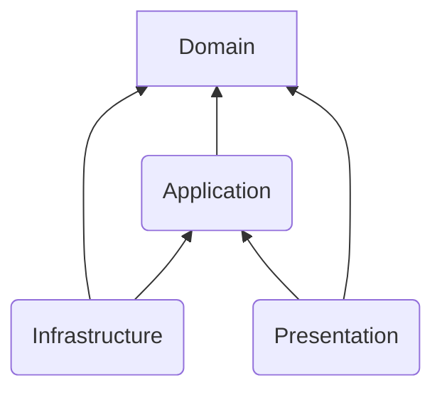

# Architecture & Layering Rules

## 1. 🏗️ High-Level Architecture
We follow **Clean Architecture**. Respect strict dependency rules:

- **Domain:** (Core) Entities, Logic. **NO dependencies** on outer layers.
- **Application:** Use Cases. Depends ONLY on Domain.
- **Infrastructure:** DB, API Clients, File System. Depends on Domain/Application.
- **Contracts:** (Shared Types) The LOWEST level. **NO dependencies**. Everyone depends on this.

## 2. Layer Isolation Rules

| Layer | Can Import From | MUST NOT Import From |
| --- | --- | --- |
| **Contracts** | *None* | Domain, Application, Infrastructure, UI |
| **Domain** | Contracts | Infrastructure, Application, UI |
| **Application** | Domain, Contracts | Infrastructure, UI |
| **Infrastructure** | Domain, Application, Contracts | UI |
| **UI** | Domain, Application, Contracts | Infrastructure (Direct DB access) |

### 🚨 Critical Rules
- **Domain** code must NOT import from `infrastructure` (e.g., no `import { prisma } ...` in Domain).
- Define interfaces in Domain/Contracts, implement them in Infrastructure.
