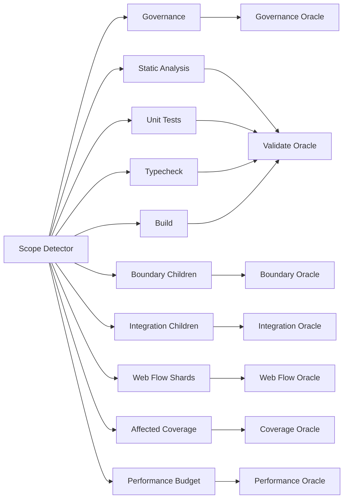

---
tags:
  - testing
  - architecture
  - ci
  - target-state
description: MemoFlow Test System V2 的当前架构、执行契约、质量门禁与验收指标
created: 2026-08-04T00:00:00+08:00
updated: 2026-08-04T00:00:00+08:00
---

# Test System V2 当前架构

> 状态：已实施。代码、项目 target、`.github/workflows/ci.yml` 和
> `.github/rulesets/main.json` 是执行真源；本文件只记录稳定契约。

## 1. 设计目标

Test System V2 将测试文件、执行器、Nx 项目图、CI DAG、GitHub ruleset 和质量报告视为一个系统。
它需要同时优化五个质量属性：

1. **可信度**：一个绿色 Oracle 必须对应清晰、完整且没有静默跳过的验证范围。
2. **反馈速度**：失败尽可能早暴露，完整 affected PR 不被无关串行工作阻塞。
3. **成本**：不能仅靠增加 runner 数量换取墙钟时间；重复准备和重复测试必须可见。
4. **可维护性**：测试类型、文件归属、target 和 CI job 使用同一套 vocabulary。
5. **可诊断性**：断言失败、环境失败、进程崩溃、flaky 和 timeout 必须能够区分。

非目标：

- 不为旧 target、旧 check name 或旧测试目录提供长期兼容。
- 不把所有测试强制迁移到统一物理目录；归属明确比目录形式统一更重要。
- 不在 V2 初次切换中强制引入 Nx Cloud 或自建 remote cache。
- 不通过删除关键 Web Flow、降低覆盖率阈值或扩大 retry 掩盖问题。

## 2. 统一术语

| 术语                   | 定义                                                       |
| ---------------------- | ---------------------------------------------------------- |
| Primary suite          | 一个测试文件日常只属于的唯一主要执行集合                   |
| Measurement suite      | coverage 等允许重新运行 primary suite 以生成质量指标的集合 |
| Boundary               | 进程、协议、数据库、HTTP 或浏览器等需要专门环境的边界      |
| Scope Detector         | 一次计算 PR 影响范围并向 CI 输出结构化结果的 job           |
| Child job              | 按 scope 执行实际工作的 job 或 matrix shard                |
| Oracle                 | 始终出现并聚合 child job 结论的稳定 GitHub check           |
| Legitimate skip        | detector 明确判断未受影响，且 Oracle 将其解释为成功        |
| Infrastructure failure | 测试断言执行前的 runner、进程、容器或依赖准备失败          |

## 3. 测试分层契约

| 层级       | 标准 target        | 允许的依赖                                     | 禁止承担的职责                                    | 默认缓存             |
| ---------- | ------------------ | ---------------------------------------------- | ------------------------------------------------- | -------------------- |
| 快测试     | `test`             | in-memory fake、mock、jsdom、Node              | 真实数据库、真实网络、Electron 跨进程、浏览器旅程 | 是                   |
| 覆盖率     | `test:coverage`    | 快测试及 coverage provider                     | 代替行为测试或完整 E2E                            | 是                   |
| API 冒烟   | `test:smoke`       | 路由装配、middleware、controller、测试 DB 可选 | 完整浏览器交互                                    | 是，前提是环境确定   |
| 集成测试   | `test:integration` | 真实数据库、Prisma、事务、文件系统 fixture     | 公网服务、长时间性能采样                          | 否                   |
| 边界测试   | `test:boundary`    | IPC、preload、Electron main、协议 adapter      | 与边界无关的普通 unit                             | 否或按子 target 明确 |
| 浏览器流程 | `e2e`              | Playwright、API、Web、独立数据库               | 纯函数和组件局部断言                              | 否                   |
| 性能预算   | `test:perf`        | 固定数据、确定性算法、结构化基线               | 随机模拟 DB、不可控公网、过窄 wall-clock 阈值     | 否                   |
| 治理       | `test:governance`  | 仓库结构、配置、收集清单、workflow schema      | 产品行为断言                                      | 是                   |

`test` 继续作为 Nx 和日常 TDD 的默认入口。慢测试不会隐藏在默认 target 中；只有实际跨越边界时，
才升级到对应专门 target。

## 4. 唯一归属模型

### 4.1 规则

- 每个测试文件必须有且只有一个 primary suite。
- coverage 是 measurement suite，可以有意重新运行所治理的 unit 文件。
- suite 的收集规则必须互斥；`exclude` 不是可选优化，而是契约的一部分。
- 归属优先由明确后缀或边界目录表达，不再把任意 `__tests__` 解释成某个边界。
- 测试治理从配置解析收集集合，比较文件系统全集并输出 missing、duplicate 和 unexpected。

### 4.2 推荐命名

| 后缀                      | 归属                                      |
| ------------------------- | ----------------------------------------- |
| `*.test.ts` / `*.spec.ts` | 快测试                                    |
| `*.integration.test.ts`   | 集成测试                                  |
| `*.smoke.test.ts`         | API 冒烟                                  |
| `*.ipc.spec.ts`           | Desktop IPC 边界                          |
| `*.main.spec.ts`          | Electron main-process 边界                |
| `*.bench.ts`              | 性能预算或实验，由 allowlist 决定具体车道 |

已有与源码同目录和 `__tests__` 两种组织方式都可以保留，但目录名本身不再决定测试层级。

### 4.3 Desktop 专项边界

目标收集关系：

```text
apps/desktop/src/renderer/**/*.spec.ts       -> desktop:test
apps/desktop/src/main/**/*.spec.ts           -> desktop:test（普通 main unit）
apps/desktop/src/main/**/*.ipc.spec.ts       -> desktop:test:ipc
apps/desktop/src/main/**/*.main.spec.ts      -> desktop:test:main
desktop:test:boundary                        -> 编排 ipc + main，不重复 unit
```

此前 46 个 Desktop 测试文件中，9 个 `__tests__` 文件曾同时被 `test:ipc` 和 `test:main` 收集，且
常规 `desktop:test` 还会再次收集它们。V2 必须将这 9 个文件按真实职责重新分类；IPC 测试不能再
包含 database、AI、utils 和 bootstrap 的普通测试。当前收集关系由 inventory 生成并校验，IPC/Main
使用互斥显式 include，默认 `desktop:test` 排除边界文件。

Desktop 的 Vitest 配置应共享最小 base config，但各 suite 只声明自己的 include、exclude、setup 和
coverage 例外。Electron mock surface 由需要它的边界 suite 显式拥有。

## 5. Nx 执行模型

### 5.1 标准 target

每个项目只声明它真正支持的标准 target。内部实现可以使用更细的 target，但跨项目编排只依赖：

```text
test
test:coverage
test:smoke
test:integration
test:boundary
test:perf
test:governance
e2e
```

例如 Desktop 的 `test:boundary` 编排 `test:ipc` 和 `test:main`；API 可以只暴露 `test` 和
`test:smoke`；纯领域包通常只暴露 `test`、`test:coverage` 和可选 `test:integration`。

### 5.2 inputs 与 affected

- `default` 包含项目源码、测试及必要 workspace globals。
- `production` 排除测试、coverage 和只影响 lint 的配置。
- `test` 使用 `default` 与依赖的 `production`。
- root package scripts 与 dependency/toolchain inputs 需要分开建模，不能为提速直接移除
  `package.json` 而破坏依赖变更的正确传播。
- 对 `nx.json`、锁文件、TypeScript 根配置和生成器的修改必须有专门的全量影响测试场景。

### 5.3 cache trust boundary

| 可缓存                 | 不可缓存                  |
| ---------------------- | ------------------------- |
| lint、typecheck、build | 真实 DB integration       |
| 确定性 unit、contract  | Playwright E2E            |
| 确定性 coverage        | 真实网络或 provider smoke |
| 纯结构 governance      | performance sampling      |

未来启用 remote cache 前必须确定读写主体、fork PR 权限、保留期限、敏感输出、缓存污染清理和
紧急禁用方式。没有这些决策时，只使用现有本地 Nx cache 和依赖 store cache。

## 6. CI 拓扑



### 6.1 Scope Detector

Detector 负责：

1. 解析统一的 `NX_BASE` 和 `NX_HEAD`。
2. 一次取得 affected projects。
3. 将项目图与 target capability 组合为结构化 JSON。
4. 输出 child job 是否启用以及项目列表。
5. 将 scope JSON 作为 artifact 保存，方便审计误跳过。

建议输出结构：

```json
{
  "unit": ["task", "goal"],
  "boundary": ["desktop"],
  "integration": ["task"],
  "smoke": ["api"],
  "webFlow": true,
  "coverage": ["task", "goal"]
}
```

### 6.2 Validate

当前 Validate 串行执行 governance、lint、typecheck、test 和 build。V2 将稳定 `Validate Oracle`
与实际 children 分离：

- Static Analysis：lint 及快速静态检查。
- Unit Tests：affected `test`。
- Typecheck：affected `typecheck`。
- Build：affected app build。

是否合并 Typecheck 与 Build 由真实数据决定，因为二者可能共享依赖 build。任何组合都必须保留稳定
Oracle 名称，而不是让 ruleset 依赖会变化的 child job。

### 6.3 Boundary 与 Integration

- Smoke、integration 和 Desktop boundary 按环境成本分组，而不是盲目一 target 一 runner。
- Desktop IPC/Main 在同一 prepared runner 中执行，各自保留独立 step 和日志。
- 需要 PostgreSQL 的 suites 共用该 job 的独立 service；不同并发 job 不共享数据库。
- 所有 children 都执行后由 Oracle 汇总，不能因第一个失败阻止其他独立 suite 暴露结果。

### 6.4 Web Flow

- 四个 shard 保持单 worker 和独立 PostgreSQL，防止账号及后端状态互相污染。
- shard 分配使用历史 spec duration，而不是只按文件数或测试数平均。
- 失败证据只在失败时上传，包含 JSON、trace、video、screenshot 和 HTML report。
- API build artifact 只有在证明节省 runner-minutes 且不增加关键路径后才共享。

## 7. Oracle 状态机

每个 Oracle 对每个 child 使用同一规则：

| Detector         | Child result              | Oracle 解释    |
| ---------------- | ------------------------- | -------------- |
| failed/cancelled | 任意                      | 失败           |
| disabled         | skipped                   | 合法跳过，成功 |
| disabled         | 非 skipped                | 配置异常，失败 |
| enabled          | success                   | 成功           |
| enabled          | skipped/cancelled/failure | 失败           |

Oracle job 使用 `if: always()`，不得因为 dependency skipped 而自身消失。Oracle 逻辑需要独立的脚本或
单元测试覆盖上述状态组合，避免在 YAML 中复制多套易漂移 shell 判断。

## 8. GitHub ruleset

`main` 必须启用 ruleset，required contexts 与当前 Oracle 名称完全一致。动态 children 和 matrix shard
不直接作为 required check。

规则至少包括：

- 禁止删除 `main`。
- 禁止 non-fast-forward 更新。
- 合并必须经过 pull request。
- 所有 required Oracle 成功，包括合法未受影响时仍会出现的 `Performance Oracle`。
- required checks 使用 strict policy，基于最新 `main` 验证。
- 紧急绕过主体和操作流程单独记录，不把 disabled ruleset 当日常开发状态。

## 9. Coverage 模型

### PR affected coverage

- 只运行 affected 且受 coverage governance 的项目。
- Domain、application use case、store 和 Prisma mapper 各自保留明确 threshold。
- `Coverage Oracle` 在没有相关项目时合法成功，在有项目但任一 gate 失败时失败。

### Full coverage audit

- nightly 和手工触发运行全部受治理项目。
- 用于发现 Nx affected、项目 tags、target capability 或 inputs 配置漏检。
- 保存 machine-readable summary，跟踪 threshold、项目数量和跳过原因。

Coverage 不追求仓库统一百分比；门禁按业务风险和受治理子树定义。阈值变化需要显式评审，不能通过
排除新增源码静默维持数字。

## 10. 性能模型

### PR Performance Budget

- 固定输入和随机种子。
- 充分 warm-up，报告 median、p95 和样本数。
- 使用足以容忍共享 runner 噪声的预算。
- 优先验证算法级趋势、操作数量和数量级，而不是亚毫秒绝对值。
- 与 checked-in baseline 比较时记录 Node、runner 和数据集版本。

### Nightly Performance Experiment

- 真实 PostgreSQL、文件系统、GC 和大数据量。
- 多轮采样并保存 JSON artifact。
- 默认 informational；只有稳定度得到证明后才升级为 required gate。
- benchmark 名称必须准确表达模拟或真实边界。

现有 `memory.bench.ts`、`db-vs-sorting.bench.ts` 和 workflow 宣称的阈值在 V2 切换时必须统一处理：
要么进入正确车道并真实执行，要么删除，不能继续形成“文件存在但 CI 没有验证”的假象。

## 11. 失败、retry 与 flaky policy

| 类型                    | 自动 retry       | 处理                                      |
| ----------------------- | ---------------- | ----------------------------------------- |
| 断言失败                | 否               | 直接失败，保留最小证据                    |
| runner/setup failure    | 最多一次         | 标记 infrastructure，重试准备阶段         |
| Nx/native process crash | 最多一次         | 收集版本、exit code、signal 和 crash 日志 |
| timeout                 | 默认否           | 判断产品等待、死锁还是资源不足            |
| flaky                   | 不依赖无限 retry | 建立有 owner 和过期时间的隔离记录         |

重试成功不能将原始失败完全隐藏。CI summary 应记录首次失败分类、是否重试和最终结果。

## 12. 可观测性与成本

每次 CI 输出统一 summary：

- base/head SHA 和 affected scope。
- 每个 child 的 queue、setup、execution 和 post 时间。
- cache restore、local hit、remote hit/miss。
- 测试文件数、测试数、skip 数和 retry 数。
- 最慢 spec/test 列表。
- failure classification。
- 总墙钟时间和 runner-minutes。

结构化制品至少保留 JUnit/JSON、scope JSON 和失败证据。正常成功运行不上传大体积 video/trace。

## 13. 本地工作流

日常入口保持 Nx-first：

```bash
pnpm nx affected -t test
pnpm nx affected -t test:boundary
pnpm nx affected -t test:integration
pnpm nx affected -t e2e
```

仓库级组合入口应实现为 Nx target 或轻量 orchestrator，并只表达四种意图：

- changed：affected unit + affected boundary。
- pre-push：changed + governance。
- full：全部确定性 suites。
- release：full + coverage + E2E。

不得新增与项目 target 重复的几十个根脚本，也不得把底层 Vitest/Playwright 命令作为主要文档入口。

## 14. 基线与验收预算

2026-08-04 已知基线：

| 场景                            | 当前结果 |
| ------------------------------- | -------: |
| 优化前完整 PR                   | 约 31:00 |
| 第一阶段完整 PR                 |  约 8:20 |
| 第二阶段完整 affected PR        |     9:47 |
| docs-only PR                    |     1:33 |
| 完整 affected runner-minutes    |  约 42.3 |
| Desktop 唯一测试文件 / 文件执行 |  46 / 64 |

V2 首次切换验收预算：

- Desktop primary suite 重复执行为 0，未归属文件为 0。
- docs-only PR 保持在约 90 秒量级，所有 Oracle 明确成功。
- 普通 affected PR 比当前同范围基线更快，不能仅依赖更多 runners。
- 完整 affected PR 首阶段目标 7–8 分钟；Web shard 平衡后再评估 6 分钟级目标。
- 完整 affected runner-minutes 不高于当前约 42.3 分钟。
- coverage regression 在合并前失败。
- required Oracle 无法通过直接 push 或 disabled ruleset 绕过。
- assertion、infrastructure、crash、flaky 和 timeout 在 summary 中可区分。

## 15. 相关决策与实施

- [ADR-040: Test System V2 单一归属与稳定门禁](../architecture/adr/ADR-040-test-system-v2.md)
- [Test System V2 一次性重构计划](../plan/active/2026-08-04-test-system-v2-refactor.md)
- [当前测试分层](./architecture.md)
- [当前 CI 测试与反馈性能](./ci-validation.md)
