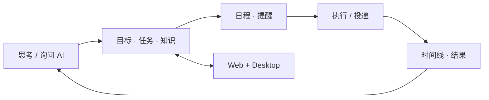

# 知行 MemoFlow

> **AI 优先的个人生产力工作区** —— 让对话、目标、任务、知识、日程、提醒与执行结果处在同一个持续工作流里。

<p align="left">
  <strong>语言：</strong> <a href="../../README.md">英文</a> · 简体中文
</p>

<p align="left">
  <a href="https://memoflow.bakersean.top"><strong>在线 Web 产品</strong></a> ·
  <a href="https://bakersean168.github.io/memoflow/"><strong>项目介绍</strong></a> ·
  <a href="../product/README.md"><strong>产品文档</strong></a> ·
  <a href="../architecture/README.md"><strong>系统架构</strong></a>
</p>

MemoFlow 是一个面向个人长期使用的 AI 效能工作区。它不是把 Chatbot 放到传统 Todo 应用旁边，而是让 AI 对话与 Goal、Task、Note、Schedule、Reminder、Notification 等业务对象共享同一套产品上下文：用户可以从对话中形成意图，再进入结构化工作区确认和编辑，通过产品契约执行，最后沉淀为可追踪结果。

当前仓库同时包含 Web、Electron Desktop、API、共享领域包、契约、AI 运行时、同步与发布基础设施，是一个完整的多端产品工程，而不只是前端演示。

## 产品模型



### 可以做什么

- **AI 工作区** —— 持续对话、开放聊天，以及面向 Goal / Task / Knowledge 的类型化 AI 工作流。
- **目标与任务** —— 把方向拆成可执行目标和任务，并保留业务状态、关系与结果。
- **笔记与知识库** —— 管理知识与资源，并把内容作为工作流中的一等上下文。
- **日程与提醒** —— 把任务和计划连接到统一时间语义，而不是维护另一套孤立日历模型。
- **通知与投递** —— 通过统一 operation / delivery 契约追踪通知意图、尝试与结果。
- **Web + Desktop** —— Vue Web 与 Electron Desktop 共享核心业务契约；PowerSync 支撑跨端数据路径。

## 工作区体验

桌面工作区采用三栏模型：

```text
会话侧栏 | AI 协作区 | 业务工作区
         |           | Goal / Task / Note /
         |           | Schedule / Reminder ...
```

AI 区是持续协作入口，业务工作区则拥有结构化状态和更大的编辑面积。顶部全局入口可以直接打开 Goal、Task、Note、Reminder、Schedule、Notification；业务标签页表达当前上下文，而不是再复制一套导航。

当前工作区契约见 [`docs/product/workspace-ui.md`](../product/workspace-ui.md)。

## 工程亮点

| 工程问题 | MemoFlow 的处理方式 |
| --- | --- |
| 多端一致性 | 集中式 `@memoflow/contracts` + transport parity |
| AI 运行时 | TypeScript + Mastra，内嵌在产品运行时中 |
| 持久 AI 工作流 | 类型化 workflow state、恢复/取消路径、产品持有 projection |
| 模块化业务领域 | Goal / Task / Schedule / Reminder / Notification / Repository 包 |
| 多客户端数据 | PostgreSQL + PowerSync + 显式离线/query-cache 策略 |
| 投递语义 | operation、occurrence、delivery intent/attempt/receipt 契约 |
| 可审计性 | 统一 operation timeline、replay 与 execution context |
| 质量门禁 | Nx 管理 lint/typecheck/test、浏览器流程、覆盖率/性能/投递 oracle |

## 系统架构

```text
┌──────────────────────────────────────────────┐
│ Web (Vue)          Desktop (Electron + Vue) │
└───────────────┬───────────────┬──────────────┘
                │ 共享契约 / 客户端 API
                ▼
┌──────────────────────────────────────────────┐
│ API / 组合根                                │
│ Express · Zod · Prisma · Mastra runtime     │
└───────────────┬───────────────┬──────────────┘
                │               │
                ▼               ▼
          PostgreSQL          Redis
                │
                ▼
            PowerSync
```

Monorepo 让产品运行面保持轻量，把可复用业务行为下沉到共享包：

```text
apps/
├── api/        Express API + 服务端组合
├── desktop/    Electron 桌面客户端
├── web/        Vue Web 客户端
└── mobile/     移动端容器 / 未来运行面

packages/
├── contracts/  跨层公开契约
├── ai/         基于 Mastra 的 AI 运行时与工作流
├── goal/ task/ schedule/ reminder/ notification/ ...
├── app-vue/    共享 Vue 应用层
├── ui-*/       UI 基础组件 / 适配器
└── utils/      共享支持代码

docs/           产品、架构、ADR、标准、部署与计划
tools/          CI、治理、运行时与测试系统工具
```

## 技术栈

- **语言：** TypeScript 6
- **工作区：** Nx 23、pnpm 11
- **Web：** Vue 3、Vite 8、Tailwind CSS 4、shadcn-vue
- **桌面端：** Electron 43 + Vue 3
- **API：** Express 5、Zod、Prisma
- **AI：** Mastra 1.x
- **数据：** PostgreSQL、Redis、PowerSync
- **测试：** Vitest、Playwright、Storybook、axe-core
- **交付：** GitHub Actions、Docker Compose、Alibaba Cloud ACR + ECS

## 快速开始

### 环境要求

- Node.js 22.13+
- pnpm 11+
- 用于本地基础设施的 Docker 与 Compose

### 安装与运行

```bash
git clone https://github.com/BakerSean168/memoflow.git
cd memoflow
pnpm install
cp .env.example .env.local
pnpm docker:dev:up
pnpm nx run-many -t serve --projects=api,web --parallel=2
```

桌面端开发：

```bash
pnpm nx run desktop:serve-safe
```

`desktop:serve-safe` 会准备依赖并重建 Electron 原生模块。环境预热完成后，`pnpm nx run desktop:serve` 是更快的日常开发循环。

完整本地开发指南见 [`docs/guides/development/local-development.md`](../guides/development/local-development.md)。

## 质量与验证

仓库把产品和架构契约做成可执行门禁，而不是只写在 README 里的承诺。

```bash
pnpm lint
pnpm typecheck
pnpm test
pnpm e2e
pnpm docs:check
pnpm governance:check
```

受保护的 `main` 在推进之前，CI 还会运行治理、集成、浏览器流程、覆盖率、性能与投递观测等专用检查。

## 生产环境

当前 Web 生产入口：**[memoflow.bakersean.top](https://memoflow.bakersean.top)**。

GitHub Pages 有意只承担公开的 **项目介绍页**。真实产品继续使用既有生产技术栈，由仓库中的部署契约约束 Web / API / PowerSync / PostgreSQL / Redis 等组件。

参见 [`docs/deployment/README.md`](../deployment/README.md) 与 [`docs/guides/development/release-workflow.md`](../guides/development/release-workflow.md)。

## 文档地图

- [`docs/getting-started/README.md`](../getting-started/README.md) —— 新成员入门。
- [`docs/product/README.md`](../product/README.md) —— 产品能力与模块地图。
- [`docs/product/workspace-ui.md`](../product/workspace-ui.md) —— 当前工作区体验。
- [`docs/architecture/README.md`](../architecture/README.md) —— 架构入口。
- [`docs/architecture/adr/README.md`](../architecture/adr/README.md) —— 架构决策。
- [`docs/standards/README.md`](../standards/README.md) —— 工程标准。
- [`docs/test/README.md`](../test/README.md) —— 测试系统。
- [`docs/deployment/README.md`](../deployment/README.md) —— 生产拓扑与运维。

## 仓库状态与许可

MemoFlow 是一个 **公开源码仓库**，但当前 **没有附带开源许可证**。仅公开可见并不代表授予复制、修改或再分发代码的许可；除非未来明确加入许可证，否则版权仍由仓库所有者保留。
