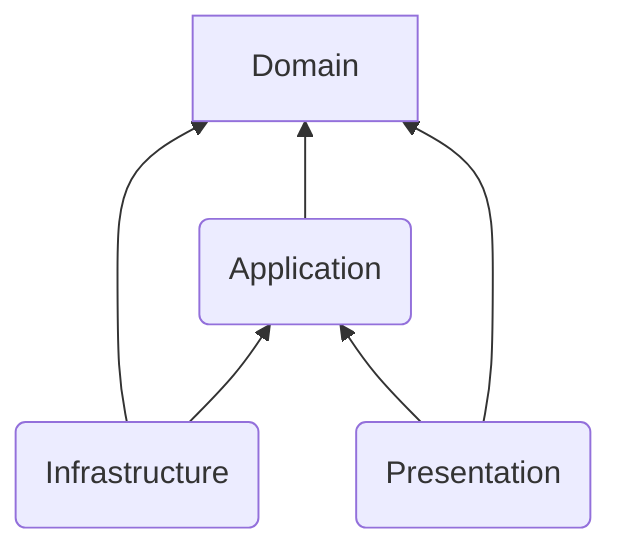

# DailyUse Project Context & Agent "Bible"

> **CRITICAL INSTRUCTION FOR AGENTS:**
> You are working on the **DailyUse** project. This document is your **Source of Truth**.
> You MUST align all your code generation, refactoring, and analysis with the rules defined below.
> **DO NOT DEVIATE** from these standards without explicit user instruction.

## 1. 🏗️ High-Level Architecture
We follow **Clean Architecture**. Respect strict dependency rules:



- **Domain:** (Core) Entities, Logic. **NO dependencies** on outer layers.
- **Application:** Use Cases. Depends ONLY on Domain.
- **Infrastructure:** DB, API Clients, File System. Depends on Domain/Application.
- **Contracts:** (Shared Types) The LOWEST level. **NO dependencies**. Everyone depends on this.

## 2. 🚨 ZERO-COMPROMISE RULES

### Rule #1: Type Centralization (`@dailyuse/contracts`)
- **NEVER** define shared types, DTOs, or Interfaces in `application-*` or `infrastructure-*` if they are used across boundaries.
- **ALWAYS** place them in `packages/contracts`.
- **Import** using `import type { ... } from '@dailyuse/contracts';`.

### Rule #2: API Response Format
- **ALWAYS** use `ok: boolean`. **NEVER** use `success: boolean`.
- Use standard result types from contracts:
  ```typescript
  import type { ActionResult, ActionWithDataResult } from '@dailyuse/contracts';
  // Correct
  return { ok: true, data: ... };
  // WRONG
  return { success: true, ... };
  ```

### Rule #3: Layer Isolation
- **Domain** code must NOT import from `infrastructure` (e.g., no `import { prisma } ...` in Domain).
- Define interfaces in Domain/Contracts, implement them in Infrastructure.

## 3. 📂 Project Structure Map

- **`apps/`**: Deployable units (api, desktop, web).
- **`packages/contracts`**: **(The Holy Grail)** All shared types, DTOs, Enums.
- **`packages/domain-server` / `domain-client`**: Pure business logic.
- **`packages/application-server` / `application-client`**: Use Cases / Orchestration.
- **`packages/infrastructure-server` / `infrastructure-client`**: Implementations (Prisma, Axios).
- **`packages/ui-*`**: View components.

## 4. 🛠️ Development Standards

- **Naming:** PascalCase for Classes/Types (`User`), camelCase for vars/funcs (`getUser`).
- **Files:** kebab-case (`user-service.ts`).
- **Exports:** Prefer named exports over default exports.

## 5. 🔍 Where to find specific rules?
If you are unsure, read these ADRs in `docs/architecture/adr/`:
- [ADR-008: API Response Format](docs/architecture/adr/ADR-008-standard-api-response-format.md)
- [ADR-009: Clean Architecture](docs/architecture/adr/ADR-009-standard-clean-architecture-layers.md)
- [ADR-010: Contracts](docs/architecture/adr/ADR-010-standard-centralized-contracts.md)
- [ADR-011: Naming](docs/architecture/adr/ADR-011-standard-naming-conventions.md)
- [ADR-012: Error Handling](docs/architecture/adr/ADR-012-standard-error-handling.md)
- [ADR-013: Testing](docs/architecture/adr/ADR-013-standard-testing-strategy.md)
- [ADR-014: TypeScript](docs/architecture/adr/ADR-014-standard-typescript-guidelines.md)
