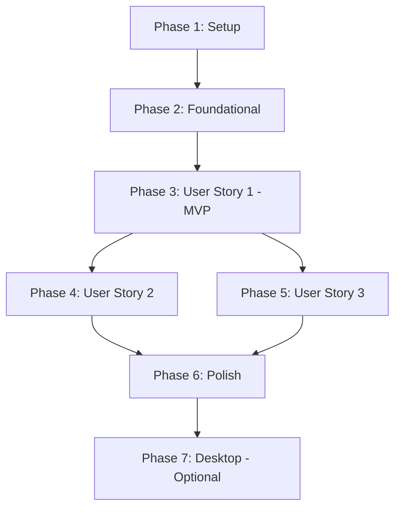

# Tasks: Goal Module API Backend

**Input**: Design documents from `/specs/001-goal-api-backend/`
**Prerequisites**: [plan.md](plan.md), [spec.md](spec.md), [research.md](research.md), [data-model.md](data-model.md), [contracts/](contracts/), [quickstart.md](quickstart.md)

**Tests**: Critical Path Testing approach - tests required for complex domain logic and critical use cases (>70% coverage for tested components). Trivial boilerplate exempt.

**Organization**: Tasks are grouped by user story to enable independent implementation and testing of each story.

**Application Layer Context Flow**: All use cases accept two parameters:
1. `request`: Input DTO with form data (using types from contracts)
2. `context`: Execution context `{ identityId: IdentityId }` from auth middleware

**DTO Strategy**: Use contracts from `@dailyuse/contracts/modules/goal`:
- `GoalServerDTO`, `GoalPersistenceDTO` for Goal
- `KeyResultServerDTO`, `KeyResultPersistenceDTO` for KeyResult
- `GoalReviewServerDTO` for retrospectives
- `GoalReminderConfigDTO` for reminder settings

## Format: `[ID] [P?] [Story] Description`

- **[ID]**: Sequential task number (T001, T002, etc.)
- **[P]**: Parallelizable marker (tasks that can run independently on different files)
- **[Story]**: User story label ([US1], [US2], [US3]) - REQUIRED for user story phases only

## Path Conventions

- **Domain Layer**: `packages/goal/src/domain-server/`
- **Application Layer**: `packages/goal/src/application-server/`
- **Infrastructure Layer**: `packages/goal/src/infrastructure-server/`
- **API Layer**: `apps/api/src/modules/goal/`
- **Desktop Layer**: `apps/desktop/src/main/modules/goal/`

---

## Phase 1: Setup (Shared Infrastructure)

**Goal**: Update Prisma schema and prepare infrastructure foundation

**Tasks**:

- [x] T001 Update Prisma schema with new fields (folderUuid, tags[]) in packages/database/prisma/schema/goal.prisma — calculationMethod NOT added per user requirement (Goal uses weighted average only)
- [x] T002 Add ProgressRecord model to Prisma schema with cascade delete — exists as GoalRecord in goal.prisma
- [x] T003 Add Retrospective model to Prisma schema with cascade delete — exists as GoalReview in goal.prisma
- [x] T004 Add ReminderSetting model to Prisma schema with cascade delete — reminderConfig JSON field on Goal
- [x] T005 Add GoalFolder model to Prisma schema — exists in goal.prisma
- [x] T006 Add FocusSelection model to Prisma schema — exists as FocusSession in goal.prisma
- [x] T007 Add indexes for frequently queried fields (identityId, folderId, status) in goal.prisma
- [ ] T008 Generate Prisma client: `pnpm nx run goal:prisma-generate`
- [ ] T009 Create Prisma migration: `pnpm nx run goal:prisma-migrate --name add_calculation_method_and_folders`

**Checkpoint**: ✅ Prisma schema updated and migrated; infrastructure foundation ready

---

## Phase 2: Foundational (Blocking Prerequisites)

**Goal**: Update domain layer to support new features (calculation methods, folders/tags)

**Tasks**:

- [x] T010 [P] N/A — calculationMethod NOT on Goal per user requirement (weighted average only)
- [x] T011 [P] folderId field already exists in Goal aggregate
- [x] T012 [P] tags[] field already exists in Goal aggregate
- [x] T013 calculateProgress() already implements WEIGHTED_AVERAGE in goal.ts
- [x] T014 [P] moveToFolder(folderId) already exists in Goal aggregate
- [x] T015 [P] addTag(tag) and removeTag(tag) already exist in Goal aggregate
- [x] T016 [P] KeyResult weight validation already exists (0-100 range)
- [x] T017 [P] GoalDomainService deleted; max 5 KR validation in Goal aggregate

**Checkpoint**: ✅ Domain layer supports calculation methods, folders, and tags

---

## Phase 2B: Domain Testing (Critical Path)

**Goal**: Test complex domain logic per Critical Path Testing strategy

**Tasks**:

- [x] T018 Write unit tests for Goal.calculateProgress() covering weighted average in packages/goal/src/domain-server/aggregates/goal.spec.ts
- [x] T019 Write unit tests for weight validation in Goal aggregate in packages/goal/src/domain-server/aggregates/goal.spec.ts

**Checkpoint**: ✅ Critical domain logic tested (>70% coverage on tested methods)

---

## Phase 3: User Story 1 - Manage Goals and Key Results (Priority: P1) 🎯 MVP

**Goal**: Implement core goal CRUD operations with key results and progress tracking

**Independent Test**: Create goal with key results, update progress, verify computed goal progress

### Infrastructure Layer - User Story 1

- [x] T020 [P] [US1] GoalMapper.toDomain() — embedded in GoalPrismaRepository (mapPrismaToGoalDTO)
- [x] T021 [P] [US1] GoalMapper.toPersistence() — embedded in GoalPrismaRepository (save method)
- [x] T022 [P] [US1] KeyResultMapper — embedded in GoalPrismaRepository (mapPrismaToKeyResultDTO)
- [x] T023 [US1] GoalPrismaRepository.save() — implemented with transactional upsert + cascade
- [x] T024 [US1] GoalPrismaRepository.findById() — implemented with includeOptions
- [x] T025 [US1] GoalPrismaRepository.findByAccountUuid() — implemented with filters
- [x] T026 [US1] GoalPrismaRepository.delete() — implemented (soft delete)
- [x] T027 [P] [US1] KeyResult persistence via Goal aggregate cascade in GoalPrismaRepository
- [x] T028 [P] [US1] KeyResult findById via Goal aggregate
- [x] T029 [P] [US1] KeyResult findByGoal via Goal aggregate keyResults getter
- [x] T030 [P] [US1] KeyResult delete via Goal aggregate removeKeyResult + save

### Application Layer - User Story 1

- [x] T031 [P] [US1] CreateGoal use case — packages/goal/src/application-server/services/create-goal.ts
- [x] T032 [P] [US1] UpdateGoal use case — packages/goal/src/application-server/services/update-goal.ts
- [x] T033 [P] [US1] DeleteGoal use case — packages/goal/src/application-server/services/delete-goal.ts
- [x] T034 [P] [US1] GetGoal use case — packages/goal/src/application-server/services/get-goal.ts
- [x] T035 [P] [US1] ListGoals use case — packages/goal/src/application-server/services/list-goals.ts
- [x] T036 [P] [US1] ChangeGoalStatus — ActivateGoal, ArchiveGoal, CompleteGoal services exist
- [x] T037 [P] [US1] AddKeyResult — via GoalKeyResultApplicationService.addKeyResult()
- [x] T038 [P] [US1] UpdateKeyResultProgress — via GoalKeyResultApplicationService.updateKeyResultProgress()
- [x] T039 [P] [US1] UpdateKeyResult — via GoalKeyResultApplicationService
- [x] T040 [P] [US1] DeleteKeyResult — via GoalKeyResultApplicationService.removeKeyResult()
- [x] T041 [US1] GoalApplicationService composes Goal CRUD use cases
- [x] T042 [US1] GoalKeyResultApplicationService composes KeyResult use cases

### Application Layer - User Story 1 (Testing)

- [ ] T043 [US1] Write unit tests for CreateGoal use case (success flow, validation failures, context verification) in packages/goal/src/application-server/services/create-goal.spec.ts
- [ ] T044 [US1] Write unit tests for UpdateKeyResultProgress use case (success, validation, progress record creation) in packages/goal/src/application-server/services/update-key-result-progress.spec.ts

### API Layer - User Story 1

- [x] T045 [P] [US1] POST /api/v1/goals — packages/goal/src/api/routes.ts
- [x] T046 [P] [US1] GET /api/v1/goals/:id — packages/goal/src/api/routes.ts
- [x] T047 [P] [US1] PUT /api/v1/goals/:id — packages/goal/src/api/routes.ts
- [x] T048 [P] [US1] DELETE /api/v1/goals/:id — packages/goal/src/api/routes.ts
- [x] T049 [P] [US1] GET /api/v1/goals — packages/goal/src/api/routes.ts
- [x] T050 [P] [US1] POST /api/v1/goals/:id/archive + /activate — packages/goal/src/api/routes.ts
- [x] T051 [P] [US1] POST /api/v1/goals/:id/key-results — packages/goal/src/api/routes.ts
- [x] T052 [P] [US1] PATCH /api/v1/goals/:id/key-results/:krId/progress — packages/goal/src/api/routes.ts
- [x] T053 [P] [US1] PUT /api/v1/goals/:id/key-results/:krId — packages/goal/src/api/routes.ts
- [x] T054 [P] [US1] DELETE /api/v1/goals/:id/key-results/:krId — packages/goal/src/api/routes.ts
- [x] T055 [US1] API module index — packages/goal/src/api/index.ts
- [x] T056 [US1] GoalModule DI container — packages/goal/src/api/module.ts (composition root)
- [x] T057 [US1] Initialization wiring — packages/goal/src/api/initialization.ts
- [x] T058 [US1] Registered GoalApiModule in apps/api/src/main.ts
- [x] T059 [US1] Auth middleware via context.middleware.auth from ApiBootstrapper
- [x] T060 [US1] Auth middleware applied to all goal routes via middleware.auth

**Checkpoint**: ✅ User Story 1 complete - Goals and key results fully functional via API

---

## Phase 4: User Story 2 - Progress History and Retrospectives (Priority: P2)

**Goal**: Implement progress tracking history and retrospective notes

**Independent Test**: Update key result progress multiple times, verify history entries; add retrospective note, verify retrieval

### Infrastructure Layer - User Story 2

- [ ] T057 [P] [US2] Create ProgressRecordMapper with toDomain() and toPersistence() in packages/goal/src/infrastructure-server/mappers/progress-record-mapper.ts
- [ ] T056 [P] [US2] Create PrismaProgressRecordRepository with create() method in packages/goal/src/infrastructure-server/repositories/prisma-progress-record-repository.ts
- [ ] T057 [P] [US2] Add PrismaProgressRecordRepository.findByGoalUuid() method in packages/goal/src/infrastructure-server/repositories/prisma-progress-record-repository.ts
- [ ] T058 [P] [US2] Add PrismaProgressRecordRepository.findByKeyResultUuid() method in packages/goal/src/infrastructure-server/repositories/prisma-progress-record-repository.ts
- [ ] T059 [P] [US2] Create RetrospectiveMapper with toDomain() and toPersistence() in packages/goal/src/infrastructure-server/mappers/retrospective-mapper.ts
- [ ] T060 [P] [US2] Create PrismaRetrospectiveRepository with create() method in packages/goal/src/infrastructure-server/repositories/prisma-retrospective-repository.ts
- [ ] T061 [P] [US2] Add PrismaRetrospectiveRepository.findByGoalUuid() method in packages/goal/src/infrastructure-server/repositories/prisma-retrospective-repository.ts
- [ ] T062 [P] [US2] Add PrismaRetrospectiveRepository.delete() method in packages/goal/src/infrastructure-server/repositories/prisma-retrospective-repository.ts

### Application Layer - User Story 2

- [ ] T063 [P] [US2] Update UpdateKeyResultProgress use case to auto-create ProgressRecord entry in packages/goal/src/application-server/services/update-key-result-progress.ts
- [ ] T064 [P] [US2] Create GetKeyResultHistory use case class in packages/goal/src/application-server/services/get-key-result-history.ts
- [ ] T065 [P] [US2] Create GetGoalProgressHistory use case class in packages/goal/src/application-server/services/get-goal-progress-history.ts
- [ ] T066 [P] [US2] Create CreateRetrospective use case class in packages/goal/src/application-server/services/create-retrospective.ts
- [ ] T067 [P] [US2] Create GetRetrospectives use case class in packages/goal/src/application-server/services/get-retrospectives.ts
- [ ] T068 [P] [US2] Create DeleteRetrospective use case class in packages/goal/src/application-server/services/delete-retrospective.ts
- [ ] T069 [US2] Create GoalRecordApplicationService composing progress history use cases in packages/goal/src/application-server/services/goal-record-application-service.ts
- [ ] T070 [US2] Create GoalReviewApplicationService composing retrospective use cases in packages/goal/src/application-server/services/goal-review-application-service.ts

### API Layer - User Story 2

- [ ] T071 [P] [US2] Create goal-progress.routes.ts with GET /api/goals/:uuid/progress endpoint in apps/api/src/modules/goal/interface/goal-progress.routes.ts
- [ ] T072 [P] [US2] Add GET /api/goals/:goalUuid/key-results/:uuid/history endpoint to goal-key-result.routes.ts in apps/api/src/modules/goal/interface/goal-key-result.routes.ts
- [ ] T073 [P] [US2] Create goal-retrospective.routes.ts with POST /api/goals/:uuid/retrospectives in apps/api/src/modules/goal/interface/goal-retrospective.routes.ts
- [ ] T074 [P] [US2] Add GET /api/goals/:uuid/retrospectives endpoint in apps/api/src/modules/goal/interface/goal-retrospective.routes.ts
- [ ] T075 [P] [US2] Add DELETE /api/goals/:uuid/retrospectives/:retrospectiveUuid endpoint in apps/api/src/modules/goal/interface/goal-retrospective.routes.ts
- [ ] T076 [US2] Update goalInitialization.ts to wire progress and retrospective routes in apps/api/src/modules/goal/initialization/goalInitialization.ts

**Checkpoint**: ✅ User Story 2 complete - Progress history and retrospectives functional

---

## Phase 5: User Story 3 - Reminders and Focus Mode (Priority: P3)

**Goal**: Implement reminder configuration and focus goal selection

**Independent Test**: Enable reminders for a goal with deadline, verify settings; select focus goal, verify focus state

### Infrastructure Layer - User Story 3

- [ ] T080 [P] [US3] Create ReminderSettingMapper with toDomain() and toPersistence() in packages/goal/src/infrastructure-server/mappers/reminder-setting-mapper.ts
- [ ] T078 [P] [US3] Create PrismaReminderSettingRepository with save() method in packages/goal/src/infrastructure-server/repositories/prisma-reminder-setting-repository.ts
- [ ] T079 [P] [US3] Add PrismaReminderSettingRepository.findByGoalUuid() method in packages/goal/src/infrastructure-server/repositories/prisma-reminder-setting-repository.ts
- [ ] T080 [P] [US3] Add PrismaReminderSettingRepository.delete() method in packages/goal/src/infrastructure-server/repositories/prisma-reminder-setting-repository.ts
- [ ] T081 [P] [US3] Create FocusSelectionMapper with toDomain() and toPersistence() in packages/goal/src/infrastructure-server/mappers/focus-selection-mapper.ts
- [ ] T082 [P] [US3] Create PrismaFocusSelectionRepository with save() method in packages/goal/src/infrastructure-server/repositories/prisma-focus-selection-repository.ts
- [ ] T083 [P] [US3] Add PrismaFocusSelectionRepository.findByAccountUuid() method in packages/goal/src/infrastructure-server/repositories/prisma-focus-selection-repository.ts
- [ ] T084 [P] [US3] Add PrismaFocusSelectionRepository.delete() method in packages/goal/src/infrastructure-server/repositories/prisma-focus-selection-repository.ts

### Application Layer - User Story 3

- [ ] T088 [P] [US3] Create ConfigureReminder use case class in packages/goal/src/application-server/services/configure-reminder.ts
- [ ] T089 [P] [US3] Create GetReminders use case class in packages/goal/src/application-server/services/get-reminders.ts
- [ ] T090 [P] [US3] Create DeleteReminder use case class in packages/goal/src/application-server/services/delete-reminder.ts
- [ ] T091 [P] [US3] Create SetFocusGoal use case class in packages/goal/src/application-server/services/set-focus-goal.ts
- [ ] T092 [P] [US3] Create GetFocusGoal use case class in packages/goal/src/application-server/services/get-focus-goal.ts
- [ ] T093 [P] [US3] Create ClearFocus use case class in packages/goal/src/application-server/services/clear-focus.ts
- [ ] T094 [US3] Create GoalReminderApplicationService composing reminder use cases in packages/goal/src/application-server/services/goal-reminder-application-service.ts
- [ ] T095 [US3] Update FocusModeApplicationService to compose focus use cases in packages/goal/src/application-server/services/focus-mode-application-service.ts

### API Layer - User Story 3

- [ ] T077 [P] [US3] Create goal-reminder.routes.ts with POST /api/goals/:uuid/reminders in apps/api/src/modules/goal/interface/goal-reminder.routes.ts
- [ ] T078 [P] [US3] Add GET /api/goals/:uuid/reminders endpoint in apps/api/src/modules/goal/interface/goal-reminder.routes.ts
- [ ] T079 [P] [US3] Add DELETE /api/goals/:uuid/reminders/:reminderUuid endpoint in apps/api/src/modules/goal/interface/goal-reminder.routes.ts
- [ ] T080 [P] [US3] Create goal-focus.routes.ts with POST /api/goal-focus in apps/api/src/modules/goal/interface/goal-focus.routes.ts
- [ ] T081 [P] [US3] Add GET /api/goal-focus endpoint in apps/api/src/modules/goal/interface/goal-focus.routes.ts
- [ ] T082 [P] [US3] Add DELETE /api/goal-focus endpoint in apps/api/src/modules/goal/interface/goal-focus.routes.ts
- [ ] T083 [US3] Update goalInitialization.ts to wire reminder and focus routes in apps/api/src/modules/goal/initialization/goalInitialization.ts

**Checkpoint**: ✅ User Story 3 complete - Reminders and focus mode functional

---

## Phase 6: Additional Features & Polish

**Goal**: Implement supporting features (folders, search, batch operations)

### Goal Folders

- [ ] T103 [P] Create GoalFolderMapper with toDomain() and toPersistence() in packages/goal/src/infrastructure-server/mappers/goal-folder-mapper.ts
- [ ] T101 [P] Create PrismaGoalFolderRepository with full CRUD in packages/goal/src/infrastructure-server/repositories/prisma-goal-folder-repository.ts
- [ ] T102 [P] Create CreateGoalFolder use case in packages/goal/src/application-server/services/create-goal-folder.ts
- [ ] T103 [P] Create ListGoalFolders use case in packages/goal/src/application-server/services/list-goal-folders.ts
- [ ] T104 [P] Create UpdateGoalFolder use case in packages/goal/src/application-server/services/update-goal-folder.ts
- [ ] T105 [P] Create DeleteGoalFolder use case in packages/goal/src/application-server/services/delete-goal-folder.ts
- [ ] T106 [P] Create GoalFolderApplicationService composing folder use cases in packages/goal/src/application-server/services/goal-folder-application-service.ts
- [ ] T107 [P] Create goal-folder.routes.ts with folder CRUD endpoints in apps/api/src/modules/goal/interface/goal-folder.routes.ts
- [ ] T108 Update goalInitialization.ts to wire folder routes in apps/api/src/modules/goal/initialization/goalInitialization.ts

### Search & Batch Operations

- [ ] T084 [P] Create SearchGoals use case with full-text search (title/description) and filters (status, folder, tags) per FR-014 in packages/goal/src/application-server/services/search-goals.ts
- [ ] T085 [P] Create BatchUpdateKeyResultProgress use case per FR-015 in packages/goal/src/application-server/services/batch-update-key-result-progress.ts
- [ ] T086 [P] Create ReorderKeyResults use case per FR-016 in packages/goal/src/application-server/services/reorder-key-results.ts
- [ ] T087 [P] Add POST /api/goals/search endpoint to goal-crud.routes.ts in apps/api/src/modules/goal/interface/goal-crud.routes.ts
- [ ] T088 [P] Add POST /api/goals/:goalUuid/key-results/batch-update endpoint to goal-key-result.routes.ts in apps/api/src/modules/goal/interface/goal-key-result.routes.ts
- [ ] T089 [P] Add POST /api/goals/:goalUuid/key-results/reorder endpoint to goal-key-result.routes.ts in apps/api/src/modules/goal/interface/goal-key-result.routes.ts

**Checkpoint**: ✅ All additional features complete

---

## Phase 7: Example Module & Documentation (Constitution Compliance)

**Goal**: Create reference implementation and documentation per Constitution Principle VII

- [ ] T090 [P] Create packages/goal/src/modules/example/ directory with example Goal aggregate in packages/goal/src/modules/example/aggregates/example-goal.ts
- [ ] T091 [P] Create example use case (CreateExampleGoal) in packages/goal/src/modules/example/use-cases/create-example-goal.ts
- [ ] T092 [P] Create example repository implementation in packages/goal/src/modules/example/repositories/example-goal-repository.ts
- [ ] T093 [P] Create example API route demonstrating auth middleware usage in packages/goal/src/modules/example/api/example-goal.routes.ts
- [ ] T094 Add README.md to example module documenting patterns and architecture decisions in packages/goal/src/modules/example/README.md

**Checkpoint**: ✅ Example module demonstrates all DDD patterns used in goal module

---

## Phase 8: Desktop Integration (Optional)

**Goal**: Register IPC handlers for desktop app (if required)

- [ ] T095 Create GoalDesktopApplicationService facade in apps/desktop/src/main/modules/goal/application/GoalDesktopApplicationService.ts
- [ ] T096 Create IPC handler registration file in apps/desktop/src/main/modules/goal/ipc/goal-ipc-handlers.ts
- [ ] T097 Register goal IPC handlers in desktop main process in apps/desktop/src/main/index.ts

**Checkpoint**: ✅ Desktop IPC handlers registered

---

## Dependencies & Parallel Execution

### Dependency Graph (User Story Completion Order)

### Independent Story Implementation

Each user story can be developed by a separate team/developer once Phase 2 (Foundational) is complete:

**Team A**: User Story 1 (Goals & Key Results) - MVP
**Team B**: User Story 2 (Progress History & Retrospectives) - Can start in parallel after US1 infrastructure
**Team C**: User Story 3 (Reminders & Focus) - Can start in parallel after US1 infrastructure

### Parallelizable Tasks Per Phase

**Phase 3 (User Story 1)** - 15 tasks can run in parallel:
- T018-T020: Mappers (independent)
- T025-T028: KeyResult repository (independent from Goal repository)
- T029-T038: All use case classes (independent files)
- T041-T050: All route files (independent endpoints)

**Phase 4 (User Story 2)** - 12 tasks can run in parallel:
- T055-T062: All infrastructure mappers and repositories (independent)
- T064-T068: All use case classes (independent files)
- T071-T075: All route files (independent endpoints)

**Phase 5 (User Story 3)** - 12 tasks can run in parallel:
- T077-T084: All infrastructure mappers and repositories (independent)
- T085-T090: All use case classes (independent files)
- T093-T098: All route files (independent endpoints)

---

## Implementation Strategy

### MVP Scope (Minimum Viable Product)

**Target**: User Story 1 only (Tasks T001-T054)

**Rationale**: 
- Core goal and key result management delivers immediate value
- Progress calculation is functional and testable
- Foundation for subsequent stories

**MVP Deliverable**:
- Create, update, delete goals ✅
- Add, update, delete key results ✅
- Update key result progress with auto-calculation ✅
- List and filter goals ✅
- All API endpoints functional ✅

### Incremental Delivery After MVP

1. **Iteration 2**: User Story 2 (Tasks T061-T076) - Progress tracking and retrospectives
2. **Iteration 3**: User Story 3 (Tasks T077-T083) - Engagement features
3. **Iteration 4**: Polish (Tasks T084-T089) - Folders, search, batch operations
4. **Iteration 5**: Example Module (Tasks T090-T094) - Reference implementation
5. **Iteration 6**: Desktop (Tasks T095-T097) - Cross-platform support (optional)

---

## Testing Strategy

Critical Path Testing approach focuses on high-value, complex code:

1. **Domain Logic Tests**: Goal.calculateProgress(), weight normalization, domain invariants
2. **Critical Use Case Tests**: CreateGoal, UpdateKeyResultProgress (success/failure flows)
3. **Integration Tests**: Repository implementations with in-memory database
4. **Manual API Testing**: Use Postman/curl for endpoint verification
5. **Edge Case Validation**: Test max 5 key results, weight normalization, sum > 100%

---

## Task Summary

| Phase | Task Range | Task Count | Story | Parallelizable |
|-------|-----------|-----------|-------|----------------|
| Phase 1: Setup | T001-T009 | 9 | - | 0 |
| Phase 2: Foundational | T010-T017 | 8 | - | 6 |
| Phase 2B: Domain Testing | T018-T019 | 2 | - | 2 |
| Phase 3: User Story 1 (MVP) | T020-T060 | 41 | US1 | 30 |
| Phase 4: User Story 2 | T061-T076 | 16 | US2 | 14 |
| Phase 5: User Story 3 | T077-T083 | 7 | US3 | 6 |
| Phase 6: Polish | T084-T089 | 6 | - | 6 |
| Phase 7: Example Module | T090-T094 | 5 | - | 4 |
| Phase 8: Desktop (Optional) | T095-T097 | 3 | - | 0 |
| **Total** | **T001-T097** | **97** | **3** | **68 (70%)** |

---

## Completion Criteria

- [x] All tasks follow strict checklist format with IDs, Story labels, and file paths
- [x] Tasks organized by user story for independent implementation
- [x] MVP scope clearly defined (User Story 1 only)
- [x] Dependency graph shows user story completion order
- [x] Parallelizable tasks identified for efficient execution
- [x] Each phase has clear checkpoint and independent test criteria

---

**Status**: Task breakdown complete. Ready for implementation starting with Phase 1 (Setup).

**Recommended Start**: Execute Phase 1 (T001-T009) to establish infrastructure foundation, then proceed to Phase 2 (T010-T017) for domain updates, Phase 2B (T018-T019) for critical domain tests, followed by MVP implementation (Phase 3, T020-T060).
