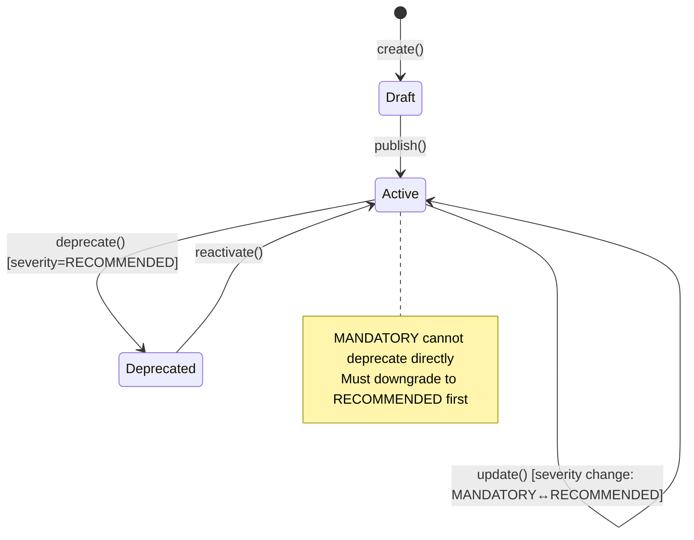
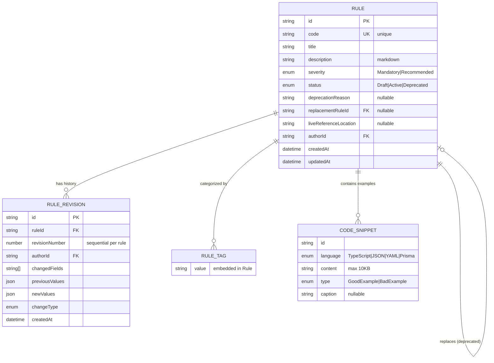

# Phase 1: Data Model — Governance Module

**Branch**: `001-governance-module` | **Date**: 2026-02-08  
**Purpose**: Define entities, relationships, validation rules, and state transitions

## Overview

The Governance module domain model consists of one aggregate root (`Rule`), one child entity (`RuleRevision`), and four value objects (`RuleId`, `RuleStatus`, `RuleSeverity`, `RuleTag`, `CodeSnippet`). The model enforces strict lifecycle constraints, immutable audit trails, and tag normalization.

---

## Aggregate Root: Rule

**Description**: The central domain object representing an architectural rule. Enforces business invariants (unique code, lifecycle transitions, example requirements) and emits domain events.

### Fields

| Field | Type | Constraints | Description |
|-------|------|-------------|-------------|
| `id` | `RuleId` (branded string) | Primary key, generated on create | Unique identifier |
| `code` | `string` | Required, unique, uppercase pattern (e.g., DDD-001, ARCH-002) | Human-readable rule code |
| `title` | `string` | Required, 3-100 chars | Short descriptive title |
| `description` | `string` (Markdown) | Required, 10-5000 chars | Full rule explanation in Markdown |
| `severity` | `RuleSeverity` | Required, enum: Mandatory \| Recommended | Enforcement level |
| `status` | `RuleStatus` | Required, enum: Draft \| Active \| Deprecated | Lifecycle state |
| `deprecationReason` | `string?` | Optional, required when status=Deprecated, 10-500 chars | Why rule was deprecated |
| `replacementRuleId` | `RuleId?` | Optional, foreign key to another Rule | Points to replacement rule if deprecated |
| `liveReferenceLocation` | `string?` | Optional, relative monorepo path (e.g., `packages/governance/src/domain/Rule.ts`) | Canonical code example location |
| `tags` | `RuleTag[]` | Required, min 1 tag, normalized to lowercase-kebab-case | Categorization labels |
| `codeSnippets` | `CodeSnippet[]` | Required, min 1 GoodExample + min 1 BadExample | Code examples |
| `authorId` | `UserId` (branded string) | Required | User who created the rule |
| `createdAt` | `Date` | Auto-generated on create | Creation timestamp |
| `updatedAt` | `Date` | Auto-updated on save | Last modification timestamp |

### Invariants (Business Rules)

1. **Unique Code**: `code` must be unique across all Rule instances (enforced by repository).
2. **Example Requirement**: At least one `GoodExample` and one `BadExample` code snippet required.
3. **Deprecation Constraint**: When `status` changes to `Deprecated`, `deprecationReason` must be non-empty.
4. **Lifecycle Constraint**: `MANDATORY` rules cannot transition directly to `Deprecated` (must downgrade `severity` to `RECOMMENDED` first).
5. **Tag Normalization**: All tags must be normalized to lowercase, trimmed, kebab-case before storage.
6. **Live Reference Validation**: If `liveReferenceLocation` is provided, it must be a valid relative path format (validation is lenient—file existence check is optional automated job).

### State Transitions (Lifecycle)



**Valid Transitions**:
- Draft → Active (publish)
- Active → Deprecated (deprecate, requires severity=RECOMMENDED)
- Deprecated → Active (reactivate)
- Active → Active (update content/severity, but not direct MANDATORY→Deprecated)

**Blocked Transitions**:
- Draft → Deprecated (direct deprecation not allowed—must publish first)
- Active (MANDATORY) → Deprecated (must downgrade severity first)

### Domain Events

| Event | Trigger | Payload |
|-------|---------|---------|
| `rule:created` | `Rule.create()` | `{ ruleId, code, title, authorId, occurredAt }` |
| `rule:updated` | `Rule.update()` | `{ ruleId, changedFields, occurredAt }` |
| `rule:deprecated` | `Rule.deprecate()` | `{ ruleId, reason, replacementRuleId?, occurredAt }` |
| `rule:reactivated` | `Rule.reactivate()` | `{ ruleId, occurredAt }` |
| `rule:status-changed` | `Rule.changeStatus()` | `{ ruleId, oldStatus, newStatus, occurredAt }` |

### Factory Methods

- `Rule.create(props: CreateRuleProps): Result<Rule>` — Creates new rule in Draft status
- `Rule.fromPersistenceDTO(dto: RulePersistenceDTO): Rule` — Restores from database (no validation, no events)
- `Rule.fromServerDTO(dto: RuleServerDTO): Rule` — Restores from API response

### Business Methods

- `activate(): Result<void>` — Transitions Draft → Active (publishes rule)
- `deprecate(reason: string, replacementRuleId?: RuleId): Result<void>` — Transitions Active → Deprecated (validates severity)
- `reactivate(): Result<void>` — Transitions Deprecated → Active
- `update(props: UpdateRuleProps): Result<void>` — Updates content fields, emits `rule:updated` event
- `changeSeverity(newSeverity: RuleSeverity): Result<void>` — Changes severity, validates lifecycle constraints
- `addTag(tag: string): Result<void>` — Adds normalized tag (prevents duplicates)
- `removeTag(tag: string): Result<void>` — Removes tag (validates min 1 tag remains)
- `addCodeSnippet(snippet: CodeSnippet): Result<void>` — Adds Good or Bad example
- `removeCodeSnippet(snippetId: string): Result<void>` — Removes snippet (validates min 1 Good + 1 Bad remains)

---

## Entity: RuleRevision

**Description**: Immutable audit record capturing every change to a Rule. Append-only—no update or delete operations. Tracks who changed what, when, and which fields were modified.

### Fields

| Field | Type | Constraints | Description |
|-------|------|-------------|-------------|
| `id` | `string` (UUID) | Primary key | Unique revision identifier |
| `ruleId` | `RuleId` | Foreign key to Rule, required | Parent rule |
| `revisionNumber` | `number` | Auto-incremented per rule (1, 2, 3...) | Sequential revision count |
| `authorId` | `UserId` | Required | User who made the change |
| `changedFields` | `string[]` | Required, non-empty | List of field names that changed |
| `previousValues` | `Record<string, any>` | Optional | Snapshot of old values (JSON) |
| `newValues` | `Record<string, any>` | Optional | Snapshot of new values (JSON) |
| `changeType` | `string` | Enum: Created \| Updated \| Deprecated \| Reactivated | Type of change |
| `createdAt` | `Date` | Auto-generated | Timestamp of revision |

### Invariants

1. **Immutability**: Once created, RuleRevision cannot be updated or deleted.
2. **Sequential Revision Numbers**: `revisionNumber` must increment sequentially (1, 2, 3...) per rule.
3. **Non-Empty Changes**: `changedFields` must contain at least one field name.

### Factory Methods

- `RuleRevision.create(rule: Rule, author: UserId, changedFields: string[], changeType: string): RuleRevision` — Creates new revision (no Result—always succeeds)
- `RuleRevision.fromPersistenceDTO(dto: RuleRevisionPersistenceDTO): RuleRevision` — Restores from database

### Business Methods

None. RuleRevision is read-only after creation.

---

## Value Object: RuleId

**Description**: Branded type for Rule identifiers. Prevents ID type confusion at compile time (e.g., passing a UserId where RuleId is expected).

### Implementation

```typescript
// domain-shared/value-objects/rule-id.ts
import { createIdType } from '@dailyuse/utils';

interface IRuleId {
  __brand: 'RuleId';
}

export const RuleId = createIdType<IRuleId>('RuleId');
export type RuleId = ReturnType<typeof RuleId.of>;
```

### Methods (from createIdType utility)

- `RuleId.generate(): RuleId` — Generates new UUID
- `RuleId.of(value: string): RuleId` — Creates from existing string (throws if invalid)
- `RuleId.tryParse(value: string): Result<RuleId>` — Safe parse (returns Result)
- `RuleId.isValid(value: string): boolean` — Validates format
- `RuleId.toString(id: RuleId): string` — Extracts string value

---

## Value Object: RuleStatus

**Description**: Lifecycle state of a Rule. Enforces valid transitions using companion object pattern.

### Definition

```typescript
// contracts/value-objects/rule-status.ts
export const RuleStatus = {
  Draft: 'Draft',
  Active: 'Active',
  Deprecated: 'Deprecated',
} as const;

export type RuleStatus = typeof RuleStatus[keyof typeof RuleStatus];
```

### Companion Object (domain-shared)

```typescript
// domain-shared/value-objects/rule-status.ts
export const RuleStatusCompanion = {
  of(value: string): Result<RuleStatus> {
    if (!Object.values(RuleStatus).includes(value as any)) {
      return Result.fail(`Invalid status: ${value}`);
    }
    return Result.ok(value as RuleStatus);
  },
  
  isValid(value: string): boolean {
    return Object.values(RuleStatus).includes(value as any);
  },
  
  canTransitionTo(from: RuleStatus, to: RuleStatus, severity: RuleSeverity): boolean {
    // Draft → Deprecated: blocked
    if (from === RuleStatus.Draft && to === RuleStatus.Deprecated) return false;
    
    // Active (MANDATORY) → Deprecated: blocked
    if (from === RuleStatus.Active && to === RuleStatus.Deprecated && severity === RuleSeverity.Mandatory) {
      return false;
    }
    
    // All other transitions allowed
    return true;
  },
};
```

---

## Value Object: RuleSeverity

**Description**: Enforcement level of a Rule. Governs deprecation constraints.

### Definition

```typescript
// contracts/value-objects/rule-severity.ts
export const RuleSeverity = {
  Mandatory: 'Mandatory',
  Recommended: 'Recommended',
} as const;

export type RuleSeverity = typeof RuleSeverity[keyof typeof RuleSeverity];
```

### Companion Object (domain-shared)

```typescript
// domain-shared/value-objects/rule-severity.ts
export const RuleSeverityCompanion = {
  of(value: string): Result<RuleSeverity> {
    if (!Object.values(RuleSeverity).includes(value as any)) {
      return Result.fail(`Invalid severity: ${value}`);
    }
    return Result.ok(value as RuleSeverity);
  },
  
  isValid(value: string): boolean {
    return Object.values(RuleSeverity).includes(value as any);
  },
};
```

---

## Value Object: RuleTag

**Description**: Normalized categorization label. Always stored in lowercase, trimmed, kebab-case.

### Implementation

```typescript
// domain-shared/value-objects/rule-tag.ts
export class RuleTag extends ValueObject<string> {
  private constructor(value: string) {
    super(value);
  }
  
  static create(raw: string): Result<RuleTag> {
    const normalized = raw.trim().toLowerCase().replace(/\s+/g, '-');
    
    if (normalized.length === 0) {
      return Result.fail('Tag cannot be empty');
    }
    
    if (normalized.length > 50) {
      return Result.fail('Tag must be 50 characters or less');
    }
    
    if (!/^[a-z0-9-]+$/.test(normalized)) {
      return Result.fail('Tag must contain only lowercase letters, numbers, and hyphens');
    }
    
    return Result.ok(new RuleTag(normalized));
  }
  
  get value(): string {
    return this.props;
  }
}
```

### Validation Rules

- Non-empty after normalization
- Max 50 characters
- Only lowercase letters, numbers, hyphens (no spaces, no special chars)

---

## Value Object: CodeSnippet

**Description**: Code example attached to a Rule. Immutable once created.

### Fields

| Field | Type | Constraints | Description |
|-------|------|-------------|-------------|
| `id` | `string` (UUID) | Primary key | Unique snippet identifier |
| `language` | `Language` | Required, enum: TypeScript \| JSON \| YAML \| Prisma | Code language |
| `content` | `string` | Required, non-empty, max 10KB | Source code |
| `type` | `SnippetType` | Required, enum: GoodExample \| BadExample | Example type |
| `caption` | `string?` | Optional, max 200 chars | Short description |

### Language Enum

```typescript
export const Language = {
  TypeScript: 'TypeScript',
  JSON: 'JSON',
  YAML: 'YAML',
  Prisma: 'Prisma',
} as const;

export type Language = typeof Language[keyof typeof Language];
```

### SnippetType Enum

```typescript
export const SnippetType = {
  GoodExample: 'GoodExample',
  BadExample: 'BadExample',
} as const;

export type SnippetType = typeof SnippetType[keyof typeof SnippetType];
```

### Implementation

```typescript
// domain-shared/value-objects/code-snippet.ts
export class CodeSnippet extends ValueObject<CodeSnippetDTO> {
  private constructor(props: CodeSnippetDTO) {
    super(props);
  }
  
  static create(
    language: Language,
    content: string,
    type: SnippetType,
    caption?: string
  ): Result<CodeSnippet> {
    if (content.trim().length === 0) {
      return Result.fail('Code snippet content cannot be empty');
    }
    
    if (content.length > 10240) { // 10KB
      return Result.fail('Code snippet must be 10KB or less');
    }
    
    if (!Object.values(Language).includes(language)) {
      return Result.fail('Invalid language');
    }
    
    if (!Object.values(SnippetType).includes(type)) {
      return Result.fail('Invalid snippet type');
    }
    
    const id = uuidv4();
    return Result.ok(new CodeSnippet({ id, language, content, type, caption }));
  }
  
  get id(): string { return this.props.id; }
  get language(): Language { return this.props.language; }
  get content(): string { return this.props.content; }
  get type(): SnippetType { return this.props.type; }
  get caption(): string | undefined { return this.props.caption; }
}
```

---

## Relationships



---

## Validation Summary

| Rule | Where Enforced | Error Message |
|------|----------------|---------------|
| Unique rule code | Repository layer (database constraint) | "Rule code {code} already exists" |
| Min 1 tag | Rule aggregate (addTag, removeTag) | "Rule must have at least one tag" |
| Min 1 GoodExample + 1 BadExample | Rule aggregate (removeCodeSnippet) | "Rule must have at least one Good and one Bad example" |
| Deprecation reason required | Rule.deprecate() method | "Deprecation reason is required" |
| MANDATORY cannot deprecate directly | RuleStatus.canTransitionTo() | "MANDATORY rules must be downgraded to RECOMMENDED before deprecation" |
| Draft → Deprecated blocked | RuleStatus.canTransitionTo() | "Draft rules cannot be deprecated directly—publish first" |
| Tag normalization | RuleTag.create() | Automatic (no error—transforms input) |
| Code snippet size | CodeSnippet.create() | "Code snippet must be 10KB or less" |

---

## Prisma Schema (Draft)

```prisma
// packages/governance/src/infrastructure/prisma/schema.prisma

model Rule {
  id                     String        @id @default(uuid())
  code                   String        @unique
  title                  String
  description            String        @db.Text // Markdown
  severity               String        // "Mandatory" | "Recommended"
  status                 String        // "Draft" | "Active" | "Deprecated"
  deprecationReason      String?       @db.Text
  replacementRuleId      String?
  replacementRule        Rule?         @relation("RuleReplacement", fields: [replacementRuleId], references: [id])
  replacedByRules        Rule[]        @relation("RuleReplacement")
  liveReferenceLocation  String?
  tags                   Json          // string[] (normalized tags)
  codeSnippets           Json          // CodeSnippetDTO[] (embedded)
  authorId               String
  createdAt              DateTime      @default(now())
  updatedAt              DateTime      @updatedAt
  
  revisions              RuleRevision[]
  
  @@map("rules")
}

model RuleRevision {
  id              String   @id @default(uuid())
  ruleId          String
  rule            Rule     @relation(fields: [ruleId], references: [id], onDelete: Cascade)
  revisionNumber  Int
  authorId        String
  changedFields   Json     // string[]
  previousValues  Json?    // Record<string, any>
  newValues       Json?    // Record<string, any>
  changeType      String   // "Created" | "Updated" | "Deprecated" | "Reactivated"
  createdAt       DateTime @default(now())
  
  @@unique([ruleId, revisionNumber])
  @@map("rule_revisions")
}
```

**Note**: Tags and CodeSnippets are stored as JSON for MVP. Post-MVP: Consider separate tables (`RuleTag`, `RuleCodeSnippet`) for better querying and indexing.

---

## Data Model Validation Checklist

- [x] All entities have clear primary keys
- [x] All relationships are explicit (1:1, 1:N, N:M)
- [x] State machine transitions are documented
- [x] Validation rules are assigned to correct layer (domain vs infrastructure)
- [x] Value objects enforce immutability
- [x] Aggregate root (Rule) enforces all invariants
- [x] Audit entity (RuleRevision) is append-only
- [x] Domain events are defined for all state changes

**Phase 1 Data Model**: ✅ **COMPLETE**

---

**Next**: Generate `contracts/` directory with API contract files.
